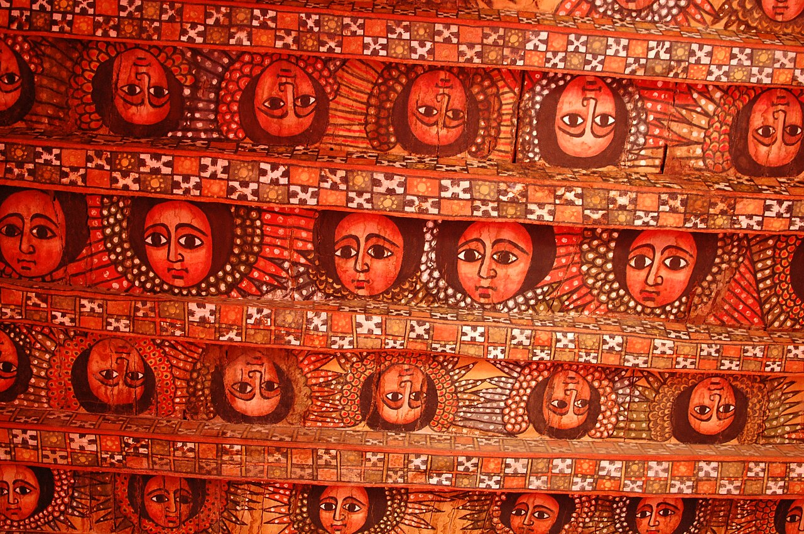
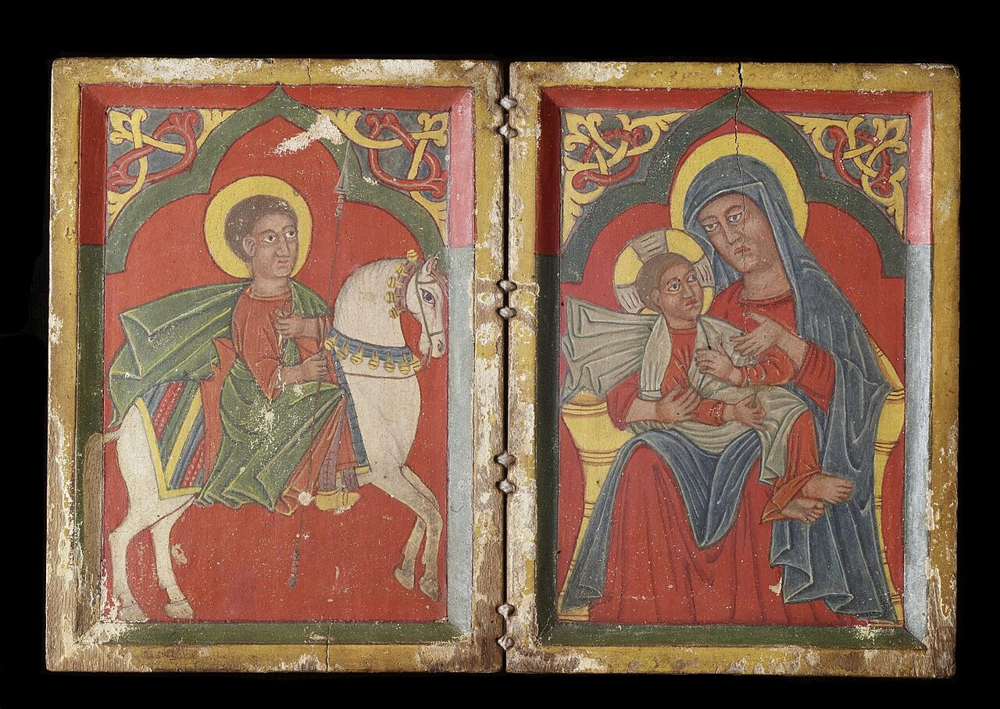
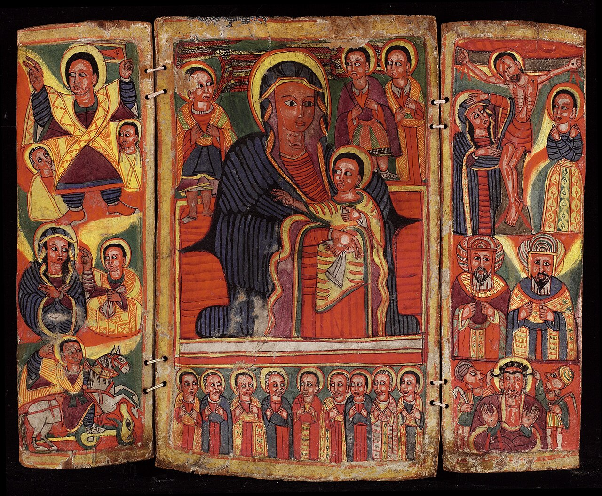
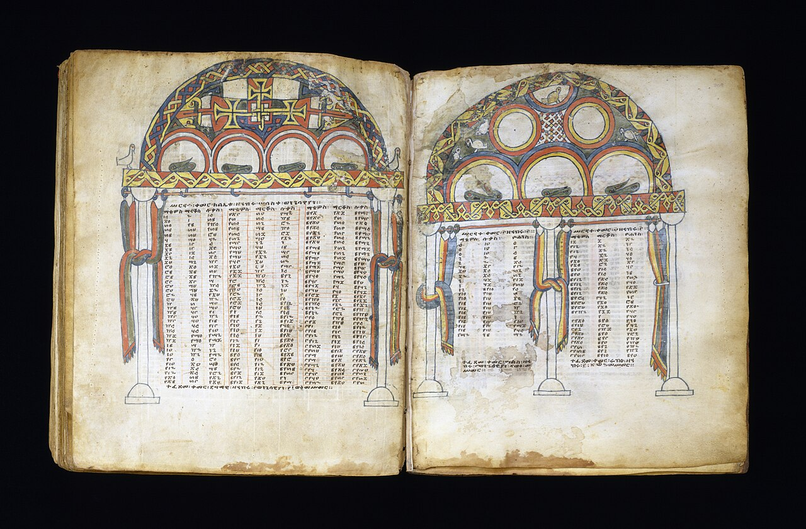
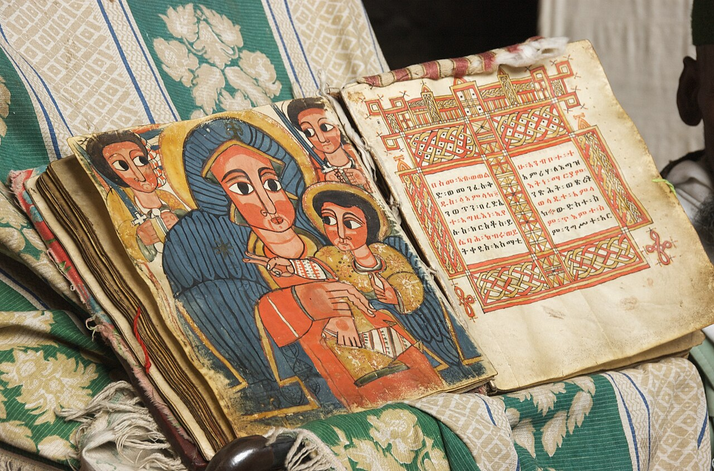
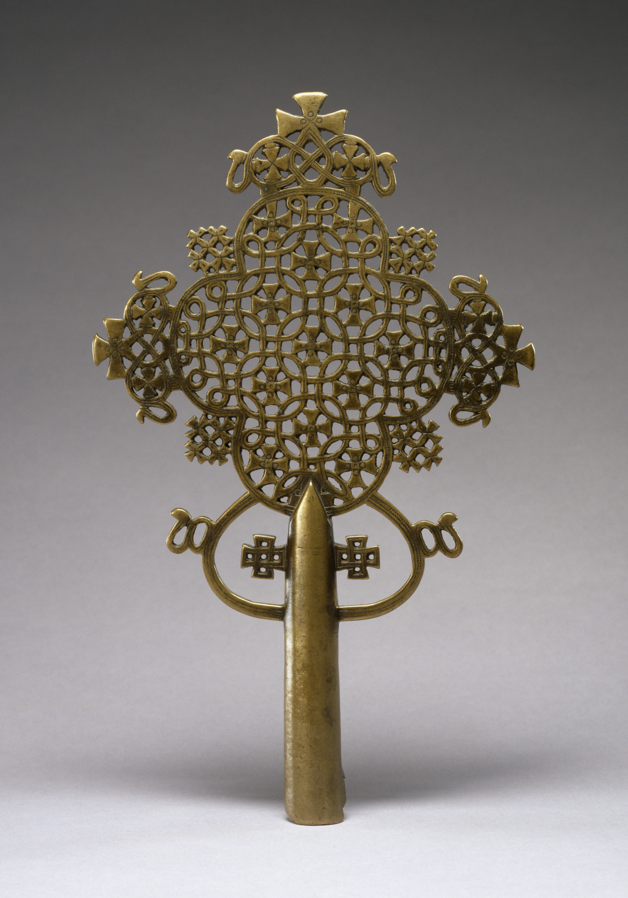
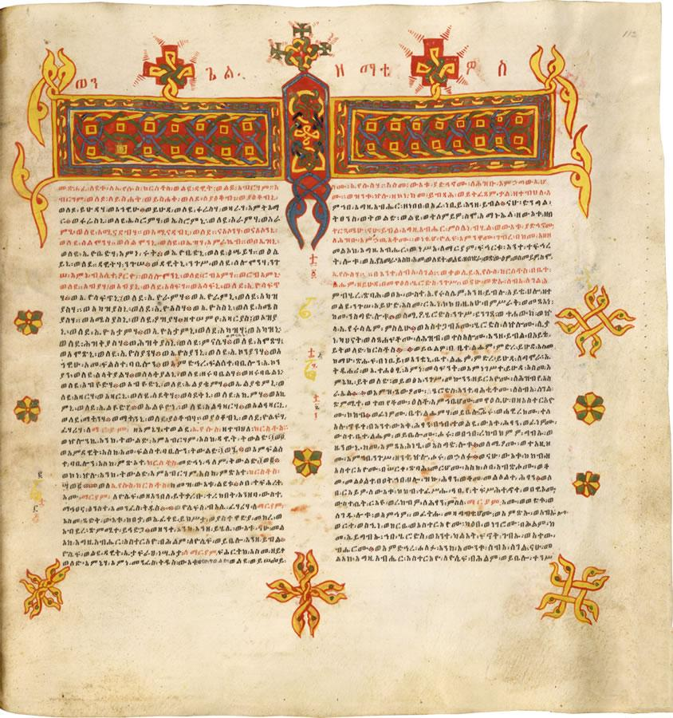
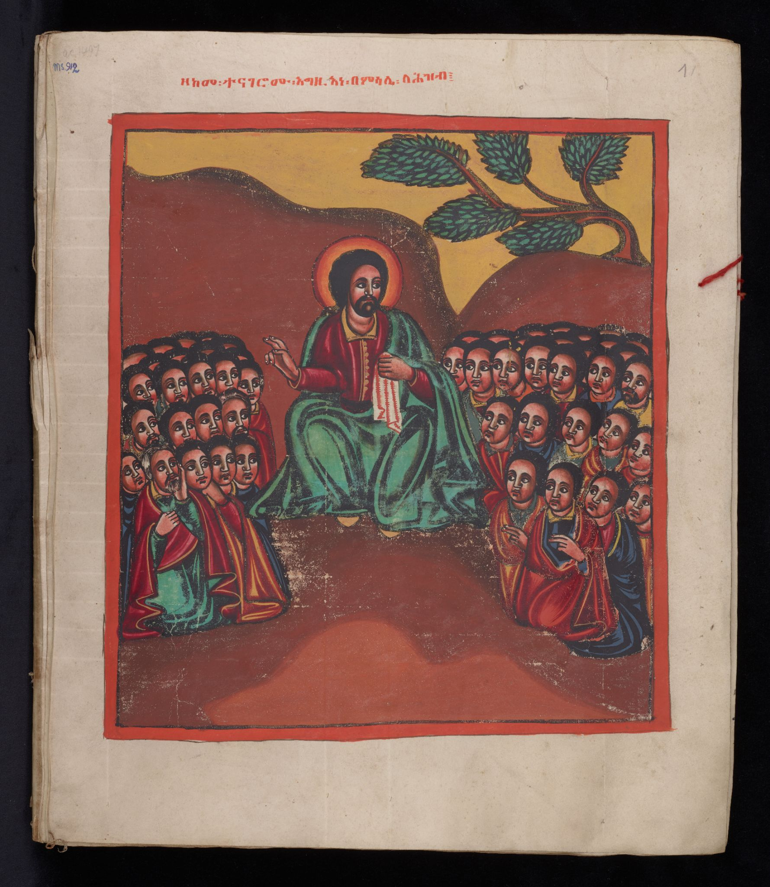
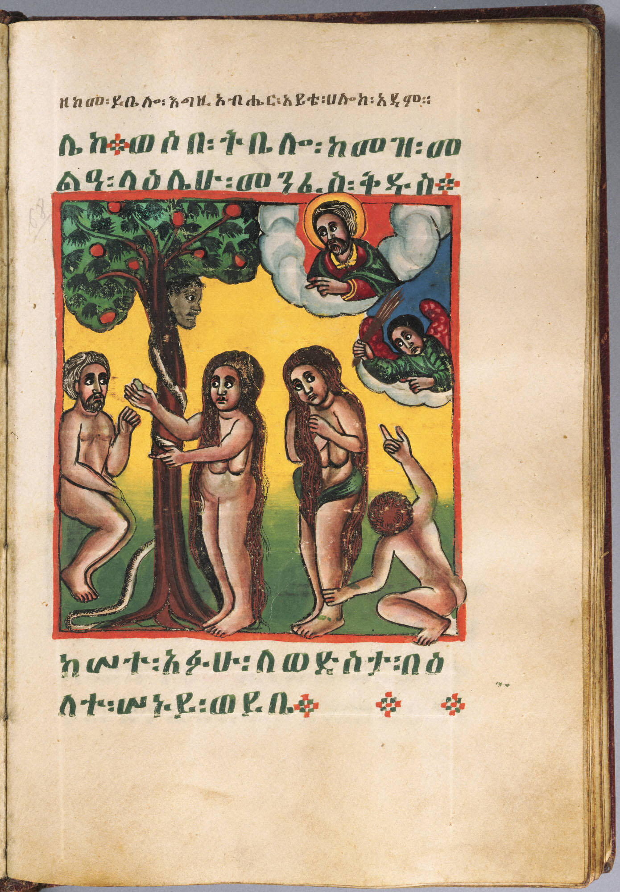

# References

# References — the reference catalog (the guide's "pics")

> Every image the Ethiopian Classical Design Language is drawn from, in one catalog. Local mood-board copies live in `references/`; eight images fetched from Wikimedia Commons for this guide live in `references/commons/`. All paths are relative to the project root and embed inline exactly as written below. The catalog is deliberately small — 13 images — because restraint is principle 3: each image licenses one or two concrete design laws, never a look.

---

## 1 · How the catalog was built

**Copied from `images/`** — the five mood-board originals (`hero-street`, `coffee`, `ms-18th-century`, `ms-gospels-harag`, `ms-geez-letterform`) were copied verbatim into `references/`.

**Fetched from Wikimedia Commons** — eight images via the Commons API (`action=query`, `generator=search` over `File:` namespace, `prop=imageinfo`), thumbnailed at a requested 1000px. Commons serves the nearest valid thumbnail width, so most files landed at 1280px; `geez-calligraphy-matthew-gospel.jpg` tops out at 844px because that is the full width of the source scan. Search terms used: *Ethiopian illuminated manuscript, haräg headpiece, Ge'ez calligraphy, Ethiopian icon, Ethiopian cross, coffee ceremony*.

**Provenance is stated honestly per row.** Three files were verified against their Commons source (one by exact MD5/SHA1 match, two by embedded EXIF metadata); two local manuscript scans remain unverified local copies and are flagged as such — do not distribute those beyond the project until provenance is cleared.

### File layout

| Path | Contents |
|---|---|
| `references/` | the five mood-board copies. Note: `references/coffee-ceremony.jpg` is a **byte-identical duplicate** of `references/coffee.jpg` (same MD5 `095e3b0e…`, left by an earlier pass) — the canonical path is `references/coffee.jpg`. |
| `references/commons/` | the eight fetched images, plus the fetcher script (`_fetch.py`) and API metadata (`_downloads.json`) as bookkeeping. |

---

## 2 · Palette & ground

The ground tokens are extracted from these. Warm-neutral by construction: parchment and gold share one hue radius (≈40°), umber and ochre another (≈21°) — specs-color-theory.md §1.

| Image | Path · shows · why it's here | Source | Credit · license |
|---|---|---|---|
|  | **`references/ms-18th-century.jpg`** — 18th-c. Ethiopian illuminated manuscript; vellum, tempera, leather binding (Princeton y1951-28). **The palette spine:** deep parchment `#E6D6BC`, umber `#573928`, gold-deep `#C9962E`, madder `#A62F1E`, umber-black `#15090B` / deep black `#0D0508`. Also the model for the illuminated frame — a gold band with marginal ornament, never a filled box. **Verified exact against Commons by hash.** | [Commons file page](https://commons.wikimedia.org/wiki/File:Ethiopian,_Illuminated_Manuscript,_18th_century.jpg) | Princeton University Art Museum · Public domain |
|  | **`references/commons/ceiling-angels-debre-berhan.jpg`** — painted ceiling of Debre Birhan Selassie, Gondar: ~80 flat, frontal angel faces looking in every direction. The exact source of the mid-umber **"ceiling angels (flesh)"** token `#6C523D`, and the origin of the almond-eyed, hieratic, frontal Watcher canon (specs-characters.md §1). | [Commons file page](https://commons.wikimedia.org/wiki/File:Debre_Birhan_Selassie_church,_Gondar_(5495130810).jpg) | Katie Hunt (Flickr) · CC BY 2.0 |
|  | **`references/commons/icon-diptych-saint-george.jpg`** — Walters 3616, diptych icon of St. George and Mary with the Infant Christ, in bright red/green/gold. The icon register: flat pigment fields, gold halo, almond eyes. Source for the Meskroch figure palette (madder robe + gold halo) and the 5×3 almond-eye geometry with its 2px inter-eye gap. | [Commons file page](https://commons.wikimedia.org/wiki/File:Ethiopian_-_Diptych_Icon_with_Saint_George,_and_Mary_and_the_Infant_Christ_-_Walters_3616.jpg) | Walters Art Museum · Public domain |
|  | **`references/commons/icon-triptych-virgin-dia.jpg`** — Detroit Institute of Arts, triptych icon of the Virgin Mary, gold ground, three panels. Source for gold-as-ground discipline (the ~3% gold cap), deep pigments seated on gold, and the **triptych structure** that maps to the terminal's three-panel composition (summary → detail → feed). | [Commons file page](https://commons.wikimedia.org/wiki/File:Ethiopian_-_Triptych,_Icon_of_the_Virgin_Mary_-_2002.3_-_Detroit_Institute_of_Arts.jpg) | Detroit Institute of Arts · Public domain |

---

## 3 · Margin, haräg & transition cues

The manuscript wayfinding system — the class of cues this guide maps to UI transitions (see §6). These are the "visual cues that denote change of direction" drawn directly from Ethiopian manuscripts.

| Image | Path · shows · why it's here | Source | Credit · license |
|---|---|---|---|
|  | **`references/ms-gospels-harag.jpg`** — a Gospels opening carrying the ornamental **haräg (interlace) band** that opens sections. Direct ancestor of the knot divider (1px gold rule + woven-diamond mark at center) and of the Grade-3 headpiece band. **Local scan; provenance unverified.** | local mood board | local scan · unverified |
|  | **`references/commons/harag-headpiece-gunda-gunde.jpg`** — Walters W850, Gunda Gunde Gospels leaf: the canonical geometric interlace (**haräg**) headpiece in red/green/gold. The model for the weave band (over/under at 1px, straps ≤ T/8, air ≥ 2× strap), for the section-opening headpiece, and for the **change-of-direction band** mapped to section changes and scroll markers. | [Commons file page](https://commons.wikimedia.org/wiki/File:Ethiopian_-_Leaf_from_Gunda_Gunde_Gospels_-_Walters_W850208V_-_Open_Group.jpg) | Walters Art Museum · Public domain |
|  | **`references/commons/manuscript-open-naakuto.jpg`** — an open illuminated manuscript, painting + illuminated text, at the monastery of Na'akuto La'ab. Shows the full manuscript frame **in situ** — double rule, marginalia, headpiece — i.e. the "manuscript as gallery wall" model, and how ornament stays on the frame while the page breathes (the 4px marginalia air gap of the frame spec). | [Commons file page](https://commons.wikimedia.org/wiki/File:Close_Up_of_Manuscript_with_Painting_and_Illuminated_Text_at_the_Monastery_of_Na%E2%80%99akuto_La%E2%80%99ab_(3415950561).jpg) | A. Davey (Flickr) · CC BY 2.0 |

---

## 4 · Motif & ornament

| Image | Path · shows · why it's here | Source | Credit · license |
|---|---|---|---|
|  | **`references/commons/cross-processional-walters.jpg`** — Walters 542894, 15th-c. processional cross of pierced interlace metalwork. The **cross-lattice** source. Its geometry is abstract-interlaced, which is precisely why the design's no-crucifix rule exists (§5 Do/Don't 6): the motif is continuous over/under interlace, never a representational cross. Carries the gold-on-umber metal tones (gold-deep `#C9962E` over umber-black `#15090B`). | [Commons file page](https://commons.wikimedia.org/wiki/File:Ethiopian_-_Processional_Cross_-_Walters_542894_-_Side_A.jpg) | Walters Art Museum · Public domain |

---

## 5 · Type & script

| Image | Path · shows · why it's here | Source | Credit · license |
|---|---|---|---|
|  | **`references/ms-geez-letterform.jpg`** — Ge'ez fidäl letterforms at high DPI (a 600dpi local scan). The letterform anatomy behind the fidel ladder, the section chips (ዜና → ዘ), the 22px display floor, and Bela Bereka's calligraphic joins. **Local scan; provenance unverified.** | local mood board | local scan · unverified |
|  | **`references/commons/geez-calligraphy-matthew-gospel.jpg`** — British Library Add. MS 59874, Matthew's Gospel in Ge'ez: **rubricated headings** (red over black body), two-column layout, marginal marks. Source for rubrication-as-urgency (madder = alert), the columnar mono-data look, and the ፡ word-separator's role between data fields. | [Commons file page](https://commons.wikimedia.org/wiki/File:Matthew%27s_Gospel_-_British_Library_Add._MS_59874_Ethiopian_Bible.jpg) | British Library · Public domain |

---

## 6 · The world

| Image | Path · shows · why it's here | Source | Credit · license |
|---|---|---|---|
|  | **`references/hero-street.jpg`** — an Addis Ababa street scene: white facades, a minibus taxi, eucalyptus. The city the gallery hangs in. Source of the **S1 Addis street frieze** and the blue-white taxi accent (lapis `#2E5E8C` stripe). EXIF carries © Denis Vermeirre 2012; **Commons provenance unverified** (his public uploads are mostly automotive) — treat as a private-collection ref. | local mood board | © Denis Vermeirre 2012 · unverified |
|  | **`references/coffee.jpg`** — the coffee ceremony (buna): jebena, cini cups, three rounds on the mesob. Source of the **S3 buna scene** and the madder/umber clay; carries the ochre world accents. A downscaled export of ProtoplasmaKid's *Coffee ceremony of Ethiopia and Eritrea* series (Commons originals run 4000–6000px, so hash-verification is not possible — attribution is from the embedded EXIF). | [Commons file page (series)](https://commons.wikimedia.org/wiki/File:Coffee_ceremony_of_Ethiopia_and_Eritrea_1.jpg) | ProtoplasmaKid · CC BY-SA 4.0 |
|  | **`references/commons/coffee-ceremony-protoplasmakid.jpg`** — *Coffee ceremony of Ethiopia and Eritrea* (roasted barley + the ceremony's accoutrements). The ceremony world beyond the pot: qetema, incense, ritual order — and the three-round rhythm (abol / tona / baraka) that underlies the hieratic 3-cycle rule (specs-characters.md §1.2). | [Commons file page](https://commons.wikimedia.org/wiki/File:Coffee_ceremony_of_Ethiopia_and_Eritrea_2.jpg) | ProtoplasmaKid · CC BY-SA 4.0 |

---

## 7 · Manuscript cues → UI transitions (the wayfinding map)

The design language's transitions, wayfinding, and change-of-direction cues come directly from these manuscript conventions. The mapping below is first-class, not decorative: every cue resolves to a hairline, a marker, or a single band — never a full-margin carpet (restraint is principle 3).

| Manuscript cue (from refs above) | License | UI mapping |
|---|---|---|
| **haräg headpiece** — ornamental band opening sections (`ms-gospels-harag`, `harag-headpiece-gunda-gunde`) | the weave band (over/under, straps ≤ T/8) | **Section changes:** the knot divider (1px gold rule + woven-diamond mark at center, drawing outward from center on scroll-into-view); the Grade-3 headpiece band over the hero; the frame-inscription on load |
| **Rubrication** — red for emphasis / divine names / headings = the urgent marker (`geez-calligraphy-matthew-gospel`, `ms-18th-century`) | madder `#A62F1E` / on-ink red `#E8836F` | **Urgency & status changes:** alert/negative state, the red alert eye-dot, rubricated headings in Manuscript mode, the delta-flash wash |
| **፡ word-separator** — between words / data fields (`geez-calligraphy`, `ms-geez-letterform`) | the Noto Sans Ethiopic ፡ wordspace (a true 0.6em advance) | **Field separation:** the ፡ between ticker items and chip pairs ("Markets · Exchange" / "ገበያ · ምንዛሪ"); the 6px gold diamond + 24px gap in the flowing ticker |
| **Marginalia & annotation markers** (`manuscript-open-naakuto`, `ms-18th-century` frame's 4px marginalia band) | page numerals in HH Lemd 11px in the frame's air gap | **Scroll & navigation markers:** the 1px gold gallery rail filling with scroll (linear, a thread); page numerals; annotation dots beside data |
| **Ornamental boundary bands** (`harag-headpiece-gunda-gunde`, `cross-processional-walters`) | frame grades 1–3 (double-rule stack, weave band, rivet lozenge) | **Tabs & panel boundaries:** tab underlines, the umber-panel border, gold hairline rules — one instrument per container |
| **The manuscript index** — canon tables / Ge'ez section chips (the Gospels' fidäl initials) | fidäl-initial chips (ዜና → ዘ), sticky section chips with drawn underline | **Navigation:** Ge'ez section chips keying each section to its initial — the lectionary index as nav |

**Restraint rule for all six:** a cue is a 1px rule, a ≤12px dot, or one band — and only the middle part of a frame may carry pattern. When in doubt, remove a strap (specs-deep-dive.md, "Air is the ornament").

---

## 8 · What each reference licenses (token map)

| Reference | Licenses (exact tokens / laws) |
|---|---|
| `ms-18th-century` | parchment `#FCF9F3` → deep parchment `#E6D6BC`; umber `#573928`; gold-deep `#C9962E`; madder `#A62F1E`; umber-black `#15090B` / `#0D0508`; the illuminated frame (Grade 3) |
| `ceiling-angels-debre-berhan` | mid umber `#6C523D` ("ceiling angels (flesh)"); almond-eyed frontal Watcher; 1:8 hieratic elongation |
| `icon-diptych-saint-george` / `icon-triptych-virgin-dia` | gold-as-ground (≤3% cap, never a fill); madder robe; halo disc Ø24; the Meskroch figure palette; the three-panel structure |
| `cross-processional-walters` | the cross-lattice motif; the **no-crucifix** rule; gold-on-umber hairline |
| `ms-gospels-harag` / `harag-headpiece-gunda-gunde` | the haräg band → knot divider, headpiece, weave over/under; change-of-direction cue |
| `manuscript-open-naakuto` | frame in context: double rule + marginalia band; ornament on the frame, page breathes |
| `ms-geez-letterform` / `geez-calligraphy-matthew-gospel` | fidäl anatomy; rubrication = urgency (madder); the ፡ separator; section chips; the 22px floor; mono columns |
| `hero-street` / `coffee` / `coffee-ceremony-protoplasmakid` | the world: S1 Addis street frieze, S3 buna scene, ochre-orange `#E46F30` (palette table's "ref A"), indigo `#181B2D` (its "ref B" — the deep cool shadow, the only negative-b* token), lapis `#2E5E8C` taxi stripe |

*Note on the palette table's "ref A / ref B / ref C / ref D":* those are the mood board's own labels. In this catalog the parchment/gold families map to the manuscript scans (Group 2), and the world photos (Group 6) carry the ochres and the deep cool shadows. `#FCF9F3` parchment white traces to the manuscript grounds, not to a single photograph.

---

## 9 · Attribution & license notes

- **Public domain** (Princeton, Walters ×2, British Library, Detroit Institute of Arts): no attribution required by law; courtesy credit to the owning institution per Commons norms.
- **CC BY 2.0** (Katie Hunt — ceiling; A. Davey — Na'akuto): attribute *title · author · CC BY 2.0 · link*.
- **CC BY-SA 4.0** (ProtoplasmaKid — both coffee files): same, plus share-alike on any derivative.
- **Unverified local scans** (`ms-gospels-harag`, `ms-geez-letterform`, `hero-street`): keep in-project; do not redistribute publicly until provenance/license is cleared.

---

## Sources

- [Ethiopian, Illuminated Manuscript, 18th century — Princeton University Art Museum](https://commons.wikimedia.org/wiki/File:Ethiopian,_Illuminated_Manuscript,_18th_century.jpg)
- [Debre Birhan Selassie church, Gondar (5495130810) — Katie Hunt](https://commons.wikimedia.org/wiki/File:Debre_Birhan_Selassie_church,_Gondar_(5495130810).jpg)
- [Ethiopian - Diptych Icon with Saint George, and Mary and the Infant Christ - Walters 3616](https://commons.wikimedia.org/wiki/File:Ethiopian_-_Diptych_Icon_with_Saint_George,_and_Mary_and_the_Infant_Christ_-_Walters_3616.jpg)
- [Ethiopian - Triptych, Icon of the Virgin Mary - 2002.3 - Detroit Institute of Arts](https://commons.wikimedia.org/wiki/File:Ethiopian_-_Triptych,_Icon_of_the_Virgin_Mary_-_2002.3_-_Detroit_Institute_of_Arts.jpg)
- [Ethiopian - Leaf from Gunda Gunde Gospels - Walters W850208V - Open Group](https://commons.wikimedia.org/wiki/File:Ethiopian_-_Leaf_from_Gunda_Gunde_Gospels_-_Walters_W850208V_-_Open_Group.jpg)
- [Close Up of Manuscript with Painting and Illuminated Text at the Monastery of Na'akuto La'ab (3415950561) — A. Davey](https://commons.wikimedia.org/wiki/File:Close_Up_of_Manuscript_with_Painting_and_Illuminated_Text_at_the_Monastery_of_Na%E2%80%99akuto_La%E2%80%99ab_(3415950561).jpg)
- [Ethiopian - Processional Cross - Walters 542894 - Side A](https://commons.wikimedia.org/wiki/File:Ethiopian_-_Processional_Cross_-_Walters_542894_-_Side_A.jpg)
- [Matthew's Gospel - British Library Add. MS 59874 Ethiopian Bible](https://commons.wikimedia.org/wiki/File:Matthew%27s_Gospel_-_British_Library_Add._MS_59874_Ethiopian_Bible.jpg)
- [Coffee ceremony of Ethiopia and Eritrea (series) — ProtoplasmaKid](https://commons.wikimedia.org/wiki/File:Coffee_ceremony_of_Ethiopia_and_Eritrea_1.jpg) · [2](https://commons.wikimedia.org/wiki/File:Coffee_ceremony_of_Ethiopia_and_Eritrea_2.jpg)


---

# Part I — Identity, Principles, Palette

# Part I — The Identity, the Principles, the Palette

> **"Maleda — an infusion of Ethiopian culture into modern design."**

---

## 1 · The Identity

The whole language fits in one sentence, and the sentence does two jobs. It says *what the product is* — digital products across apps for a bilingual Amharic–English audience. And it says *what the design believes*: the terminal is not a dashboard, it is a gallery. The wall is parchment, the panels are the paintings, and the figures who watch over the market are the gallery's guardians. The one thing that breaks the museum calm is the data itself — a rate ticks, and a painting comes alive.

Everything the guide describes — the six principles, the tokens, the type, the motion, the manuscript cues — is an attempt to keep that single sentence true on every surface, in every expression.

### How it was built: mood board → pigment → principle

The language was not designed from taste; it was *extracted*. The build ran in three deliberate moves.

**1 · The mood board.** The raw material was gathered as a curated reference set: a street scene and market photographs (the world of Addis, the mercato, the white minibus), the coffee ceremony (the jebena, the three cini cups, the incense), an 18th-century illuminated Gospel manuscript with its haräg headpiece and marginalia, a second manuscript page for its gold illumination, a close letterform study of Ge'ez, plus the Debre Berhan Selassie ceiling angels and a mural. This set defined the emotional range: vernacular street warmth at one end, sacred manuscript gold at the other. (DESIGN-LANGUAGE.md §2, "Every value extracted programmatically from reference images"; specs-characters.md, the S1/S2/S3 scene vocabulary.)

**2 · Pigment extraction.** From that set, colors were pulled programmatically, image by image, and each token kept its source attached as provenance — *this hex came from the manuscript's dominant ink, that green from the market after cleaning.* Extraction was followed by a cleaning pass: the market's raw deep green `#061F1C` and deep red `#440709` were lifted and warmed into usable pigments, and every step of every scale was made to blend toward the two *warm* manuscript neutrals (Parchment 300 and Ink 900), never toward white or black — because white/black mixing is exactly what grays a pigment out and turns it websafe (specs-color-theory.md, "The warm-neutral derivation law"). The palette was not chosen; it was recovered from the sources and then cleaned without letting it cool.

**3 · Principles, then grammar.** The six principles (below) came out of the material, not before it. The richness of the tradition had to be honored without becoming decoration, so the principles were written as *laws about restraint* — space, scarcity, one memorable thing. And because a design language that stops at taste is not buildable, a deep-dive fan-out turned every principle into a measured grammar: the harmony is stated in CIELAB hue angles, the "calm" is derived as a luminance-energy split, the gold cap is proven from relative luminance, the pairs that collapse under color-vision deficiency are enumerated (specs-color-theory.md; specs-deep-dive.md). This is why the guide can say *"the tradition's palette is physically incapable of buzzing — restraint by structure, not willpower."*

The chosen expression is **★ Editor — the home base**: near-white, type-led, minimal, the Ethiopian character carried by type and color alone, with the rates table a clean bordered table rather than a painting. Gallery, Terminal, and Manuscript remain as modes the product can move into by surface — four voices of the same grammar, never four designs. (DESIGN-LANGUAGE.md §8.)

### Where the manuscript enters (the cue for what follows)

The newest directive is that the visual cues for *change of direction* — section changes, navigation, tabs, scroll markers, status — should come from Ethiopian manuscript convention rather than from generic UI pattern. The headpiece band that opens a manuscript section, the rubricator's red, the word-separator ፡ that divides fields, marginalia, boundary bands, the manuscript's own index of Ge'ez section initials: these become the guide's first-class **transitions & wayfinding** system, mapped onto section changes, tabs, scroll, and status. That system is specified in full in a later section of this guide; what matters here is that it is not an ornament bolted on — it is the same provenance pipeline as the palette. The haräg band is extracted from the same Gospel manuscript that gave us the gold; rubrication red is the same madder. The identity's promise holds because every system in the guide — color, type, frame, figure, and now wayfinding — draws from the same sources.

---

## 2 · The Six Principles

These are the shared laws that hold across every surface and every expression (DESIGN-LANGUAGE.md §1). Nothing below them is negotiable; the expressions differ only in how the laws voice themselves.

1. **Space is a feature.** Generous whitespace is load-bearing — every view breathes, nothing competes; the gallery is mostly wall.
2. **Ethiopian soul, modern bones.** The structure is clean and minimal; the palette, the line, and the motifs carry the Ethiopian classical character.
3. **Restraint by default.** The tradition's richness lives in deliberate places, not everywhere; ornament is earned, never ambient.
4. **One memorable thing.** A single signature element per view — usually the live eye-dot — and everything else stays quiet.
5. **Order through proportion.** One consistent 4px scale and a strict type ladder; classical thinking as a measurable grid.
6. **Drawn from the source.** Every color and motif traces to Ethiopian classical art, modernized but never diluted into decoration.

---

## 3 · The Palette

Every value is extracted programmatically from the reference images; the provenance column is not decorative — it is the legal basis for the token's existence (Principle 6). The measured grammar underneath it is in specs-color-theory.md; the two rows that follow each family explain where the hex came from *and* why the family behaves the way it does on the wheel.


*Fig. 1 — The 18th-century Gospel manuscript (references/ms-gospels-harag.jpg): the haräg headpiece that opens sections, gold illumination, and rubricated red. This is the single most load-bearing source image — it gives the guide its gold (`#C9962E`), its saffron yellow (`#E8A33D`), and its rubrication-red tradition (which modernizes into madder).*


*Fig. 2 — The street / market world (references/hero-street.jpg): the mercato from which the two market pigments were extracted — madder `#A62F1E` (cleaned and lifted from `#440709`) and verdigris `#1E8A5E` (from `#061F1C`). It is also the world of the minibus's madder-over-lapis route band and the warm umbers of the vernacular ground.*


*Fig. 3 — The coffee ceremony (references/coffee.jpg): the buna scene that seeds the warm hospitality register — the warm umbers, the single madder rim band on the jebena, and the visual culture for the three-cup ceremonial rhythm the system echoes (three pigments, three weave strands, three rounds of coffee).*

### 3.1 The tokens, with provenance

**Ground — the light world (the gallery wall).** The wall is near-white but never neutral: it is parchment, a yellow-leaning warm white.

| Token | Hex | Provenance |
|---|---|---|
| parchment white | `#FCF9F3` | ref C / ref A — the bleached-but-warm page |
| parchment | `#F5E9D1` | ref C — the working page / card surface |
| deep parchment | `#E6D6BC` | ref C / manuscript — wells and sunken fields |

On the measured wheel, parchment sits at hue 85–91°, chroma 3–15 — near-achromatic but *warm*. Because the ground belongs to the same hue family as the pigments (the whole system is warm), every pigment laid on parchment shares a warm component; even verdigris reads as "cool within warm," never foreign (specs-color-theory.md §5b). This is the deep reason the palette coheres on parchment when it would not on a gray ground.

**Ink — the dark world (the paintings).** The panels where dense data lives are umber-black — warm blacks with a red lean, never neutral, never cool-blue.

| Token | Hex | Provenance |
|---|---|---|
| umber black | `#15090B` | manuscript (dominant ink) |
| deep black | `#0D0508` | manuscript — the live cavity / deepest well |

Ink measures hue 8.8°, chroma 4.4 — a warm black with a *red* lean. This is the manuscript fact: illumination has no cool shadows (specs-color-theory.md §2.1). Both grounds are warm, which is what lets one harmony grammar survive the light/dark flip unchanged.

**Secondary — the umbers (the structure).** Umber is the workhorse: frames, dividers, muted text, panel borders. It is the wedge's own earth — the desaturated core that harmonizes with every warm pigment by hue and with cool pigments by contrast.

| Token | Hex | Provenance |
|---|---|---|
| mid umber | `#6C523D` | ceiling angels (flesh) — the Debre Berhan flesh tone |
| umber | `#573928` | manuscript |
| dark umber | `#45311F` | mural |

**Highlight — the gold family (the signature).** Gold is not a color; it is manuscript gold-leaf catching light. It is the wedge's brightest high-chroma point, dosed at ~3%, and it is *never a fill*.

| Token | Hex | Provenance |
|---|---|---|
| parchment gold | `#F8E6B8` | manuscript |
| honey gold | `#E5C193` | ref C / D — the bright tint, dark-theme gold |
| gold (deep) | `#C9962E` | manuscript — the illumination gold |

The structural reason gold harmonizes: parchment and gold sit on the *same hue radius* (both ~40°). Gold 100→900 is literally "parchment at rising chroma, falling value" — which is why gold hairlines look drawn *on* the wall and never fight it, and why gold is allowed everywhere while madder and verdigris are rationed (specs-color-theory.md, "The wheel grammar"). Parchment-gold's luminance (Y 0.80, nearly as bright as the wall) buys it the tightest area ceiling in the system — the ~3% gold cap is *derived*, not asserted.

**Accent — the 10%.** These are the only hues allowed to carry chroma, and they live in exactly 10% of any view. Two of them come from the market, cleaned and warmed; the rest from the manuscript.

| Token | Hex | Provenance |
|---|---|---|
| madder red | `#A62F1E` | market — cleaned and lifted to the manuscript red from `#440709` |
| verdigris | `#1E8A5E` | market — cleaned and lifted from `#061F1C` |
| saffron | `#E8A33D` | manuscript yellow |
| ochre-orange | `#E46F30` | ref A |
| indigo | `#181B2D` | ref B — the shadow / support pigment |

**Role mapping** (terminal semantics, DESIGN-LANGUAGE.md §2): verdigris = positive / tick-up · madder red = negative / alert · saffron = highlight / caution · ochre-orange = CTA / urgent · parchment gold = labels & hairlines / live. On dark panels use the lightened variants — verdigris `#7BC9A8`, red `#E8836F`, saffron `#E8C46A`, pale gold `#E5C193` — the 300-tint law (specs-deep-dive.md "Color system & tokens"). The **on-ink ramp** further refines these: sage `#6FB796` (preferred over mint), madder-coral `#E58672`, saffron `#E8C46A`, each with hover / pressed / dim substeps that move luminance *and* temperature together so a deuteranope still separates states where red and green merge (specs-deep-dive.md "On-ink accent ramp").

### 3.2 The color-theory grammar — why these hues cohere

The token table is the *what*. The grammar below is the *why* — the measured wheel map every rule derives from. All hue angles are CIELAB hue_ab (specs-color-theory.md §1).

**The wheel in three sentences.** The system is a **42° warm wedge** (madder 38.7° → gold 80.7°, parchment extending to ~91°), one **cool counterpoint** 78.6° past the wedge (verdigris 159.3°), and one **shadow point** (indigo 289.1°). Everything chroma-carrying except verdigris lives inside the wedge. The wheel sector 180°–270° (cyan → blue → violet) is **empty — and that emptiness is the system's identity.** Ancient palettes read as classical precisely because they occupy a restricted arc of the wheel; this one occupies about a third and lets the rest do the work.

**The warm wedge.** Madder, ochre, saffron, gold, and umber are one continuous arc (52.4° → 80.7°, a 28.3° span) plus umber as the arc's desaturated core (chroma 18 vs the pigments' 60–68) and parchment as the wedge's pale extension. Any two warm pigments can share a viewport because their separation never exceeds ~33° (specs-color-theory.md, "The theory of growth"). Within the wedge, hierarchy is by lightness and chroma, never by hue alone.

**Rubrication red — the one loud red.** The manuscript tradition sanctions exactly one saturated red for emphasis: the rubricator's line, the divine name, the urgent marker. Madder is the system's most saturated hue (C 61), yet it sits at hue 38.7° — red-*orange*, not pure red — so even the loud red leans toward brown and stays sub-scream. There is one loud red, and only one; the eye's attention is auctioned to one place — the alert/negative state, the rubricated line (specs-color-theory.md §5c). Modernized, madder is the guide's **urgent marker**: the delta-down color, the alert eye-dot, and (per the new manuscript-cues directive) the rubrication of headings and status changes.

**Gold as scarce signature — the metal-light.** Gold reads as illumination because it is the wedge's brightest high-chroma member (C 60, L 65), it is dosed at ~3%, and it is never a fill. The 3% cap is not taste — it is derived twice: parchment-gold's luminance caps its legal area at 3.6%, and the restraint law keeps gold-500 (identity cap 3%) *below* its legal 8.3% ceiling precisely so it stays precious. More gold reads as brass. Gold is the gilding float (the sanctioned halation on parchment, marks ≤ 12px), and on the dark panel it inverts to pale gold as figure (specs-color-theory.md §1.2, §4.2). The live eye-dot, the single gilded knot, the "LIVE" word — gold appears nowhere else.

**Madder ↔ verdigris is a triad, not a complement.** The most important measured correction: madder and verdigris are **120.6° apart — a near-triadic spacing**, not the 180° complementary the palette originally claimed. True complements (blue for madder, magenta for verdigris) are absent by design. This is a feature: adjacent true complements vibrate via simultaneous contrast (the red/green buzz); a 120° pair is calm-but-alive. **Restraint by structure, not willpower.** The identity's true hue triad is madder / verdigris / indigo (for depth and shadow); the *operable data triad* is madder / verdigris / gold, where gold enters by *lightness* (ΔL 27 from madder) rather than hue — the triad's "gilding." (specs-color-theory.md §2.)

**The Second-Channel Law.** Any two colors used as sibling channels (adjacent data series, status, legend categories) must differ in ≥ 2 of three perceptual channels: hue (≥ 25° hue_ab), lightness (≥ 15 ΔL), chroma (≥ 20 ΔC). Hue-only separation inside the warm wedge is forbidden, because hue-only separation is exactly what deutan color-vision deficiency destroys. This generalizes every individual prohibition in the spec: gold ↔ saffron (6.1° of hue, ΔE 6.8 — the *worst* pair in the system, defused only by role-lock), gold ↔ ochre (28.3° hue but ΔL only 5.3), pale gold ↔ on-ink saffron (ΔE 9.18, practically identical). The delta pair survives CVD because it obeys the law: on-ink red `#E8836F` ↔ sage `#6FB796` differ by hue *and* lightness. **Never equalize their lightness.**

**The two themes are one painting at different exposure.** The grammar is theme-invariant; only L and C rescale. Because both grounds are warm — parchment at 85–91°, ink at 8.8° — the wedge / counterpoint / empty-zone structure is identical in both themes, and a theme flip never produces a vibrating pair. The invariance budget: for every accent, the hue_ab of its light and dark variants must differ by < 5° (verified: gold 80.7°/77.0°, madder 38.7°/37.1°, verdigris 159.3°/162.0° — the saffron pair at 13.1° is out of budget and should be corrected toward ~79° before the two are ever compared across themes) (specs-color-theory.md §7).

### 3.3 The restraint laws (the 10%, the two families, the flag)

These are the rules that keep the richness in deliberate places (Principle 3).

- **The 60-30-10 as luminance energy, not just area.** The page is a luminance staircase — bright wall → mid pigment → dark panel — traversed by a warm field with exactly two cool breaks and one chroma figure at a time. The measured energy split (ground ≈ 93%, secondary ≈ 5%, accent ≈ 2%) *is* why the page feels calm; the calm is arithmetic, not aesthetic (specs-color-theory.md, "The theory of weight" §1).
- **Accents in the 10%; gold ≤ 3%; max two chroma families per viewport** (gold always counts as one). Madder and verdigris are the only pigments that can legally inhabit the full 10% — which is why they are the workhorse data valences (specs-color-theory.md §1.2).
- **Saturated-on-soft.** A full-chroma pigment (C ≥ 28) may sit only on a neutral with C ≤ 20 — parchment, umber, ink — or on near-chromaless ink; minimum chroma ratio pigment:ground ≥ 2.5. Never co-seat two pigments; the manuscript model is literal — pigment is laid on the soft vellum or in the dark field, never on another pigment (specs-color-theory.md §3).
- **The flag law, given its perceptual cause.** Saffron + verdigris + madder co-present = three full-chroma hues spanning 120° at equal chroma — the loudest possible equal-weight adjacency (tricolor vibration) *and* the Ethiopian flag. Perceptual reason and cultural taboo agree: the trio never co-occurs in one frame. The weave loader is the single sanctioned full-chroma trio — the loudest moment in the system, and it must stay the only one (specs-color-theory.md §4.3).
- **The empty zone.** Any hue in 180°–270° at chroma > 25 (pure cyan/teal/blue/violet, neon) is forbidden. Indigo is the only legal cool and it is C 13; it is shadow-only, never a data channel (it is luminance-identical to ink).
- **Gold can float, but gilding never carries text.** Gold on the wall is stroke / dot / mark only, marks ≤ 12px, ≤ 3% area; any gold that must carry information moves one luminance step down to gold-700 (6.3:1) or onto the ink panel (pale gold, 11.5:1) (specs-color-theory.md §4.2).
- **Blend law for every step.** Tints blend toward Parchment 300, shades toward Ink 900 — never white, never black. Because both anchors are warm, the scale stays chromatic at every step instead of graying out (specs-deep-dive.md "Color system & tokens"). Steps: 100 = 12% pigment, 300 = 45%, 500 = core, 700 = 55% pigment + 45% ink, 900 = 30% pigment + 70% ink.

---

## Sources

- **DESIGN-LANGUAGE.md** — the canonical document (principles, palette, type, layout, signature, restraint, expressions). `C:\Users\mike-work\Desktop\Second Brain Workspace\design-language\DESIGN-LANGUAGE.md`
- **specs-color-theory.md** — the measured wheel grammar, the Second-Channel Law, the weight/luminance theory, the CVD audit, the palette-extension theory. `C:\Users\mike-work\Desktop\Second Brain Workspace\design-language\specs-color-theory.md`
- **specs-deep-dive.md** — craft spec: frame geometry, weave/interlace, the on-ink ramp, the blend law, the 60-30-10 applied, restraint rules. `C:\Users\mike-work\Desktop\Second Brain Workspace\design-language\specs-deep-dive.md`
- **specs-characters.md** — the Meskroch figure canon, the illustration system & scenes (the market, the coffee ceremony, the newsroom), the world & environments. `C:\Users\mike-work\Desktop\Second Brain Workspace\design-language\specs-characters.md`
- **specs-type-pairing.md** — the four-face closed pairing system, the Lemd/Noto Sans Ethiopic metric engineering, the Bela audit. `C:\Users\mike-work\Desktop\Second Brain Workspace\design-language\specs-type-pairing.md`
- **Reference images** — `references/ms-gospels-harag.jpg` (the Gospel headpiece; gold + rubrication), `references/hero-street.jpg` (the market street; madder + verdigris provenance), `references/coffee.jpg` (the buna ceremony; the warm world), plus `references/ms-18th-century.jpg`, `references/ms-geez-letterform.jpg`, `references/coffee-ceremony.jpg`.
- **WorkFlowy mood board** — "Ethiopian Classical Design Language" (the living companion to this guide).

---

# 3 · Type

# 3 · Type System — four voices, two ladders, one hand

The type system is the place where the Ethiopian character lives in the ★ Editor expression. Because the Editor is near-white, type-led, and minimal — "the Ethiopian character carried by type and color alone" (DESIGN-LANGUAGE.md §8) — the type is not decoration layered on a surface: it IS the surface's Ethiopianness. Bela Bereka's calligraphic fidel carries the gallery voice; Noto Sans Ethiopic carries the neutral bilingual reading plane; HH Lemd Mono owns every numeral; Noto Sans Ethiopic owns Ge'ez inside mono. This section fixes the roster, the display verdict, the two ladders, the numeral grammar, the Ge'ez/Latin metric engineering, and the restraint laws. Every value below is either shipped in the canonical specimen (`taste-test-news-article.html`) or measured from the actual font files.

---

## 3.1 The roster — four faces, four locked registers

| Role | Face | Weights | Locked register | License |
|---|---|---|---|---|
| Display — editorial voice | **Bela Bereka** | 700 only | h1, h2, pull-quote, dropcap, boot word | OFL |
| Body / UI — both scripts | **Noto Sans Ethiopic** | Variable 100–900 | every line below 1rem; the ONLY face below 1rem | OFL |
| Data — Latin numerals & literals | **HH Lemd Mono** | 400 | every numeral, every terminal figure, the hero readout | ⚠️ unlisted — verify |
| Mono Ge'ez — data & terminal | **Noto Sans Ethiopic** | 400 | Ge'ez inside the mono/data context; the wordmark ማለዳ | OFL |

The pairing is a **closed system**, and it is *engineered, not selected*: four faces fill four slots and no fifth voice is admitted into the core (specs-type-pairing.md). "Most 'pairing' in this system is metric-engineering — the Lemd+Noto Sans Ethiopic band join; the Noto+Lemd inline-numeral crossing — and almost none is face-selection."

- **Bela Bereka 700** — the calligraphic heritage voice. One weight, deliberately: "the single weight is a restraint mechanism, not a limitation" (specs-type-pairing.md). It modernizes the manuscript hand — the same pen logic that wrote the Gospels, the 18th-century canon tables, and the Amharic letters on parchment.
- **Noto Sans Ethiopic** — the quiet bilingual reading face. Because its Ethiopic and Latin metrics were engineered together, inline Ge'ez glosses need no size-adjust; a gloss is "invisible when right" (specs-type-pairing.md).
- **HH Lemd Mono** — owns every number, even big ones. Latin data, timestamps, units, tickers, tables. UPM 905, cap 0.772em, x-height 0.558em (measured, specs-type-pairing.md).
- **Noto Sans Ethiopic** — its name, ሕብር, means "thread/warp" — the interlace. A true mono (every glyph advances exactly 0.600em), drawn for columnar duty, with its fidel band sitting baseline→0.714em. Its Latin is borrowed Noto Sans Mono; it must never carry Latin duty.

The two load-bearing license flags that gate shipping: **HH Lemd Mono is unlisted/rights-unclear** (specs-type-pairing.md) — "do not ship the terminal with Lemd until cleared." The contingency is explicit: swap Lemd → **Noto Sans Mono** (OFL); because Noto Sans Ethiopic is drawn to Noto Sans Mono's geometry, the swap clears the license risk and the metric dependency in one move. **Bela Hidase** (the wordmark Latin cut) is likewise unlisted.

---

## 3.2 Why Bela stands alone as display — the pairing verdicts

Four candidates were scored against Noto body. **None is adopted as a second display voice.** Bela runs alone, and the "heritage accent" is delivered by design elements — the illuminated frame, the headpiece interlace band, the Ge'ez section chips, the gold knot — not by a second display face (specs-type-pairing.md).

**Bela 700 ↔ Noto 400/500/700 — the primary pair.** Weight contrast 700/400 is "correct and required": editorial display faces are set heavier than body, and here it is *earned rather than assumed* because the system caps Bela at 2 display moments per scroll-viewport, bans it below 1rem, and bans it from the terminal. Noto's own internal ladder (400 body / 500 inline-Ge'ez gloss / 700 uppercase label) supplies every mid-step, so body hierarchy never needs Bela (specs-type-pairing.md). The only genuine risk was overuse plus uppercase+tracking on a calligraphic face — which the spec bans (§3.6).

**The x-height question is neutralized, not matched** — because the two faces never share a line. The 22px floor is a *pairing device*, not just a readability floor: it structurally separates Bela's optical band from Noto's, so their different x-heights never matter. Below 22px, Bela's joins and the 7 vowel-row diacritics degrade; 22px keeps ~11–12px of stroke detail on the fidel — "correct and even generous" (specs-type-pairing.md).

**One load-bearing audit result:** the shipped `BelaBereka-Bold.ttf` contains **zero Latin glyphs** (cmap = 352 Ethiopic + 29 Basic-Latin: digits and punctuation only; 0 of 52 A–Z/a–z) (specs-type-pairing.md). "Maleda" and English h1s have been silently falling through to Noto's Latin since the first render. The resolution is deliberate, not a bug:
- **Amharic h1** = Bela's Ethiopic cut — the full calligraphic moment.
- **English h1** = Noto Sans Ethiopic 700 Latin, the same clamp `2.5–3.75rem`, lh 1.05, 30ch, no tracking/uppercase. No size-adjust (1:1) because the single-language toggle guarantees the two display faces never co-render — "the language switch IS the hierarchy" (specs-type-pairing.md). The English display is modern-bones; the Amharic h1 is the manuscript.

**The candidate verdicts, in full:**

| Candidate | Verdict | Why |
|---|---|---|
| **Zemenay** | REJECT — final | Unverifiable: no OFL listing, no specimen exists. The name conflates three faces — a non-OFL grotesque (Zemenawi) that duplicates Noto's register, and a legacy serif (Goha-Tibeb Zemen) at ~348 glyphs that fails the news fidel vocabulary and is MIT/GPL, not OFL. "A name failing lookup is dead on arrival." Joins Menbere in the permanently-rejected set. If the long-form serif gap is real, the sanctioned vehicle is **Noto Serif Ethiopic** (OFL, variable, metrics-homologous to the load-bearing Noto Sans) — a family-internal extension, not a foreign voice. |
| **Agbalumo** | REJECT | It *does* carry Ethiopic (Google Fonts `ethiopic` subset) — script coverage is not the argument. Reject on (a) mood: a curvy, chunky, playful single-weight display reads retail/casual against umber/parchment/gold restraint — "a juice brand, not a gallery of content"; (b) single weight 400 is too light to hold display hierarchy against Bela 700; (c) it would be a third display personality with no unclaimed register. |
| **Ge'ez Manuscript Zemen** | ADOPT — role-locked, fifth register (not a display voice) | The ONLY candidate that fills an unclaimed register: **manuscript-initial** — the single illuminated initial / headpiece dropcap per article. OFL 1.1 ✓. It is the typographic echo of "text frames quiet, paintings ornamented": one gold fidäl per article, nothing else. Strictly bounded: `--gmz-initial` 3.2em of the paragraph em (≈54px), lh 0.85, fidel-only, ≤1 per article, **never sharing a line with Bela**, never in the terminal, gold-deep #C9962E on parchment (never madder — red reads "alert"). Gated on two passes: (1) monochrome render (force a monochrome subset — its COLR color layers must not survive), (2) optical cap-line match. Fail either → it does not ship and the system holds at four voices. |
| **Monolithic Geez** | REJECT | It has the best *idea* (squared/monumental — the one structurally contrastive candidate), but (a) proprietary license breaks the all-OFL model, and (b) role collision: its natural home — big editorial numerals and section initials — is already owned by HH Lemd and the Ge'ez section chips. "Its best role is redundant before it ships." |
| **Bela Hidase** | MAYBE — license-gated weight extension | Same designer, ExtLt→ExtBd — the lowest possible blur (a ladder addition, not a new voice). Its one legitimate seat is the **wordmark Latin** (Maleda at the lightest cut that preserves the brush joins). Blocked until the OFL license verifies; the ship fallback is Noto Sans Ethiopic 700. The discipline stays: h1 is always 700, all weights ≥22px, never in the terminal. |
| **ahabesha'stypewriter** | REJECT | Three independent hard blockers: non-commercial license, 76-glyph Latin (~19 ASCII missing), and textured vintage strokes that break tabular discipline and clash with Lemd/Noto Sans Ethiopic's monoline geometry. "It has no constructional relationship to either face." Only a deliberate vintage-telegram flourish *outside* the data layer could use it, after commercial clearance. |
| **Waldba (9 faces)** | REJECT wholesale | Nine faces = nine voices = guaranteed inconsistency; anti-restraint. |

The system's "one memorable thing" + max-2-display-moments laws argue against a second voice, and every candidate either duplicates Bela's calligraphic role or fights the restrained temperature. "The disciplined move is to keep the 4-voice system and let GMZ earn a fifth slot only if the dedicated pass clears" (specs-type-pairing.md).

---

## 3.3 The two ladders — editorial + terminal, crossing at 11px and 13px

Two ladders, one shared 4px grid (every space is a multiple of 4), passing through the **same two steps — 11px (label/head) and 13px (data/small)**. "That crossing is the 'one consistent scale'" (specs-deep-dive.md). A number can sit inside prose and a prose label can crown a table without breaking rhythm because the two faces are band-compatible at exactly 13px.

**Editorial ladder** — article view, base 16px, ratio 1.25, hero widens 1.333:

| Token | Size | Line-height (Lat / Amh) | Face | Notes |
|---|---|---|---|---|
| `--fs-h1` | clamp(2.5rem, 5.2vw, 3.75rem) = **40–60px** | 1.05 / 1.16 | Bela 700 | 30ch Lat / 24ch Ethiopic, `text-wrap:balance`. **ONE per view.** |
| `--fs-h2` | clamp(1.75rem, 3vw, 2.375rem) = **28–38px** | 1.1 / 1.2 | Bela 700 | Max 2 per view. |
| Pull-quote | clamp(1.375rem, 2.4vw, 1.75rem) = **22–28px** | 1.4 / 1.5 | Bela 700 | 1px gold hairline rules above/below, 1.5rem inset. |
| `--fs-lead` (dek) | clamp(1.125rem, 1.7vw, 1.3125rem) = **18–21px** | 1.55 / 1.65 | Noto 400 | 40rem max. |
| `--fs-body` | **17px** | 1.7 / 1.85 | Noto 400 | 42rem measure; 17px stays because fidel need the room. |
| `--fs-small` | **13px** | 1.5 / 1.6 | Noto 400 | Captions, bylines, footnotes. |
| `--fs-label` | **11px** | 1.4 | Noto 700 UPPERCASE, tracking 0.14em | The ONLY uppercase/tracked token in the editorial ladder: kicker, chip, meta. One line, always. |
| `--fs-micro` | 10px | — | — | Reserved, **DISCARDED** — no Ethiopic below 11px anywhere. |

Dropcap: Bela 700, 3.2em (~54px), color gold-deep `#C9962E` on parchment, float left, lh 0.8, `text-indent:0.5ch`, first paragraph only. **NEVER madder** — red reads "alert" in a market terminal and would collide with the alert eye-dot (specs-deep-dive.md).

**Terminal ladder** — rates/tables/ticker/console, base 13px mono, pixel-calm:

| Token | Size | Line-height | Face | Notes |
|---|---|---|---|---|
| `--ts-hero` | clamp(2.5rem, 4.5vw, 3.25rem) = **40–52px** | 1.05 | HH Lemd 400 tabular | `--panel-ink-hi` `#FBF3DB` on umber `#17130F`. THE one big number — the eye-dot's readout. Exactly one per view. |
| `--ts-rate` | 16px | 1.5 | Lemd 400 tabular | Active row / panel headline value. |
| `--ts-data` | 13px | 1.6 | Lemd 400 tabular | Every table cell, every terminal figure. |
| `--ts-tick` | 13px | 1.5 | Lemd 400 | Ticker values (the ticker is 11px label + 13px value, nothing else). |
| `--ts-head` | 11px | 1.5 | Noto 700 uppercase, tracking 0.12em | Column heads, panel titles; color `--panel-mut` `#B99A6E`. |
| `--ts-term` | 14px | 1.6 | Lemd (Lat) / Noto Sans Ethiopic (Ge'ez) | Console/log lines. |

**THE TERMINAL RULE:** the terminal contains nothing but `--ts-head` (11) and `--ts-data` (13), plus `--ts-hero` reserved for the single live number. Any third size requires justification. **Bela Bereka is banned from the terminal** (except the masthead wordmark). "The terminal's calm IS its hierarchy" (specs-deep-dive.md).

The ladder discipline kills the specimen's original failure: 17 bespoke sizes and nine letter-spacing values collapse to two ladders and **exactly three letter-spacing values in the whole system — 0 / 0.02em / 0.14em** (0.12em terminal label).

---

## 3.4 The numeral / tabular grammar — HH Lemd owns every number

**HH Lemd Mono owns every numeral, at every size, in every context** (specs-type-pairing.md). Bela never renders a number; Noto never renders a number; this also forecloses any future accent face from a numeral role. The hero readout is `--ts-hero`, not a display face: "the one number the eye watches is the worst seat for an unaudited figure set" — and Bela's numeral set is the system's single un-audited assumption.

**The measured reality (specs-type-pairing.md, from the actual fonts):** HH Lemd Mono v1.102 is a monoline **proportional** data face misnamed "Mono." Its digits advance 462–564 UPM (0.462–0.623em; up to 1.47px/13px drift) and it exposes **no `tnum`/`lnum` features** — `font-feature-settings:"tnum" 1` is a silent no-op. The old promise that "mono + tabular makes the decimal the true alignment anchor" fails in practice: '0.00' renders 27.7px vs '7.77' at 23.3px, and a full column of real rate values misaligns by up to ~6px. **The spec must state measured reality, not the false promise:** "HH Lemd figures are proportional-lining; tabular alignment is engineered at the slot level, never assumed from the font."

**Alignment is therefore engineered, never assumed:** numeric cells `text-align:right`; each figure glyph wrapped in a fixed `0.625em`-advance slot (0.625em × 905 = 565.6 UPM ≥ the widest digit advance, 564 UPM for 0 — no clipping), right-aligned to the decimal; the decimal's position becomes a function of char count only. If a licensed Lemd build ever proves genuinely tabular, the `tnum`/`lnum` invocation is restored; otherwise the slot system stands.

**The grammar, exactly** (specs-deep-dive.md):
- **Every figure:** `font-variant-numeric:tabular-nums lining-nums`. No proportional figures, no slashed zero, no other figure style.
- **Rates: always 2 decimals** — `128.40`; trailing zero kept; the decimal point is the alignment anchor across the column. Never 0, 1, or 3 places in tables.
- **Signed deltas — the sign IS the glyph.** `+0.8` / `−0.3` / `0.0`. **True minus U+2212 only, never hyphen-minus.** The sign is always present; positive carries `+`. **No ▲▼ inside tables** — triangles appear only in the ticker, where motion earns them (specs-deep-dive.md). Color the WHOLE value, never the sign alone: up `--delta-up` verdigris `#7BC9A8` on umber, down `--delta-down` red `#E8836F` (which doubles as the alert eye-dot color), flat `--panel-mut`. On parchment use the 700-steps (verdigris `#155C3E`, madder `#A62F1E`) (specs-color-theory.md).
- **Unit tokens** at `0.72em` of the figure (13px → 9.36px), baseline-aligned, muted, `white-space:nowrap`, no space inside the value string: `128.40ETB`, `/lb`, `%`. One token per figure.
- **Grouping:** ASCII comma always — `128,400`. Copy-safe and decimal-aligns identically to ungrouped.
- **Dates:** Latin digits + Ge'ez month + Latin year, in Lemd: `9 ነሐሴ 2026`. **Ethiopic numerals ፩–፱ are ceremonial/ordinal only, never data.**
- **The hero delta** rides beneath `--ts-hero` at `--ts-data` 13px, signed (`+0.8`/`−0.3`), whole-value colored. The 0.9rem stale delta and the ▲▼ are deleted — the sign is the glyph.
- **Editorial stat numeral** (optional): `--fs-stat` = HH Lemd 400 tabular, clamp(1.75rem, 3vw, 2.5rem) = 28–40px, gold-deep on parchment, same grammar, ≤1 per article.

---

## 3.5 Ge'ez/Latin metric engineering — baseline-join, 1.08em, leading multipliers

The bilingual system's depth lives here: **join on the baseline, never x-height; leading is metric-driven, never one shared line-height.**

**Leading multipliers (the single biggest fix for the "horrendous" feel).** Amh = Lat × **1.09 (body)** / × **1.11 (display)** (specs-deep-dive.md). Default EVERYTHING to `--lh-am`; use `--lh` only for pure-Latin literals (USD/ETB, timestamps, numerals). Resolved pairs: body 1.7/1.85 · small 1.5/1.64 · lead 1.55/1.71 · h1 1.05/1.16 · h2 1.1/1.22 · ts-data 1.6/1.74 · ts-term 1.6/1.74. The ×1.11 display multiplier is non-negotiable — at 40–60px, Latin 1.05 leading clips the 6th/7th-order vowel marks that overhang the fidel band (specs-type-pairing.md). A strict shared baseline is impossible with Ethiopic variable metrics — leading is metric-driven and blocks/margins align on 8px. State this so the team stops forcing one 1.75.

**The mono data join (the only true cross-face pair).** Ge'ez inside the mono context renders in **Noto Sans Ethiopic 400** against Lemd's Latin. Measured from the fonts: Lemd cap 0.772em, x 0.558em; Noto Sans Ethiopic fidel band baseline→0.714em. **The operative scale is cap-aligned: `font-size:1.08em` (0.772 ÷ 0.714 = 1.081), `vertical-align:0`, `margin-right:0.4em`** — the fidel band top lands exactly on Lemd's cap top at every ladder step (13px → fidel 14.06px, band top 10.04px = cap 10.04px). The legacy `1.04em/−0.06em` was **tuned to nothing** — the −0.06em nudge only dropped the band further below cap — and is deleted (specs-type-pairing.md). The join is em-relative and position-invariant across both ladders (11→60px). If Lemd's license fails and Noto Sans Mono replaces it, the join re-derives to `1.02em/0` (Noto canonical cap 0.729 ÷ 0.714 = 1.021).

**The script-exclusivity rule is mandatory.** One fidel owner per table (Noto Sans Ethiopic in the terminal), one Latin owner (Lemd), no cross-over, no fallback that mixes them in one line. Noto Sans Ethiopic's Latin is borrowed Noto Sans Mono — any fallback that puts Latin/digits in the Noto Sans Ethiopic slot injects a second Latin design into Lemd's proportional Latin. Fidel are **left labels, never numeric columns**: "You cannot line a fidel column up against a Latin column by width — never try; alignment is by role, not by measure" (specs-type-pairing.md). The two grid cadences (Noto Sans Ethiopic's rigid 0.600em, Lemd's proportional) are a feature: they visually separate the fidel word from the Latin instrument.

**The wordmark — the only permanent bilingual pair.** ማለዳ (Noto Sans Ethiopic 400) + Maleda (the lightest Bela cut that preserves the brush joins — Bela Hidase 300/400 — with **Noto Sans Ethiopic 700 as the ship fallback**, since Bela Bereka ships no Latin), fixed at **1.25rem**, 0.6em gap (12px), **baseline-aligned, zero vertical shift**, tracking 0. Measured: Noto Sans Ethiopic's fidel band (0.714em) lands on Bela's cap height (0.700em) — band-on-cap, a ~1.4% optical crown, correct for a wordmark. Both scripts set in a **single ink per theme** — ink 900 `#15090B` on light, parchment 100 `#FCF9F3` on dark; never gold, never two-color. ማለዳ and Maleda are the same word ("news") — a transliteration pair, which is what licenses the one legitimate cross-script display moment; it is a mark, never a sentence, and never tracked, never scaled below 1.25rem (specs-type-pairing.md).

**Inline Ge'ez gloss (body):** exactly **1em** (no adjust), weight 500, ink color (never an accent color in body), first occurrence glossed once with a 1px saffron underline (`text-underline-offset:0.2em`), **at most once per article**; the containing paragraph takes `--lh-am`. "If you ever feel the urge to nudge an inline gloss, that is the signal you are using the wrong Ge'ez face."

**The 11px Ethiopic floor.** No Ge'ez below 0.6875rem (11px) — below 11px the 26 fidel + 7 vowel-row marks become illegible; `--fs-micro` (10px) is discarded and no Ethiopic renders there. `--fs-label` (11px) and `--ts-head` (11px) are legal with fidel.

**Single-language display rule.** One language at a time at display size (data-lang toggle); never mix scripts in a line ≥1rem. The bilingual pair is allowed in exactly three situations: (1) the wordmark lockup (fixed, image-like), (2) the boot title block — a *composition*, not a mix: Amharic title + English line + Ge'ez chip, each single-script, composed in space, (3) label/subhead scale (≤11px, Noto same-face, 0.5em gap). The one sanctioned cross-face line below the display threshold is the terminal's mono data-accent join.

**The manuscript cue this engineering serves — the ፡ separator.** The Ethiopic word-separator ፡ (the scribe's inter-word punctuation, present in the reference manuscripts) is the data layer's field separator: in a mono cell like "ዶላር ፡ USD/ETB ፡ 128.40" the ፡ sits between the fidel identity word and the Latin instrument, and its advance is part of Noto Sans Ethiopic's true-mono 0.600em grid — it snaps to the column grid by construction (specs-type-pairing.md). It is a marker, never decoration; the manuscript's punctuation carries over as the terminal's field punctuation.

---

## 3.6 Restraint laws — type as the manuscript's change-of-direction cues

Restraint is the pairing policy. Four binding laws on the display voice, then the no-go pairs, then the manuscript cue mapping.

**The four Bela laws (specs-type-pairing.md):**
1. **Bela min 22px (1.375rem).** The wordmark at 1.25rem is the single sanctioned exception — a designed lockup, not running text. Below 22px the brush joins smear and the vowel-row marks degrade.
2. **Never uppercase + tracking on Bela.** Calligraphic joins break and presence doubles. Bela is always 700, tracking 0, mixed-case. (Ge'ez has no case — the 0.14em uppercase+tracking token is a Latin-only hierarchy device; Amharic label twins keep tracking ≤0.02em.)
3. **Banned from the terminal** except the masthead wordmark. The terminal runs 11/13 + one `--ts-hero` (Lemd).
4. **Max 2 display moments per scroll-viewport** (wordmark + h1, or h1 + one pull-quote). Display hierarchy = SIZE only, weight locked at 700. And Bela never renders a numeral.

**Only three letter-spacing values exist** in the whole system: 0 (display/body), 0.02em (small/caption/figures), 0.14em (uppercase labels only — editorial) / 0.12em (terminal head). Nine tracked elements collapse to one.

**The no-go pairing table (binding) — the negative space that holds the system together** (specs-type-pairing.md):
- Bela + any second display face in the same viewport — two displays is a voice collision; the identity permits ONE display voice.
- Bela + numerals, at every size — HH Lemd owns every number.
- Any display face below 1rem — Noto is the only face below 1rem.
- Lemd Latin + Noto Sans Ethiopic Latin in one line — two Latin designs (Noto 0.536 x-height vs Lemd 0.558), incompatible grids.
- Lemd Ethiopic + Noto Sans Ethiopic Ethiopic in one table — duplicate fidel designs with different advances; one fidel owner per table.
- Bela beside Ge'ez Manuscript Zemen, or ahabesha'stypewriter in data, or any third mono — the mono system is the metric-locked Lemd+Noto Sans Ethiopic pair.
- Noto Sans Ethiopic inside mono cells — body face breaks the 11/13 column rhythm; legal only as `--ts-head` labels.
- Script-mixing at display size; uppercase+tracking anywhere except the one label step; Ethiopic numerals in data; COLR/self-paletted faces (they can't resolve in the theme system and violate the 10% + gold≤3% discipline).

**Type as the manuscript's change-of-direction cues.** The user's directive — "the visual cues that denote change of direction etc should be similar to those in Ethiopian manuscripts" — is implemented in type on four vectors, all already specified above and all restrained to hairline discipline:

1. **Rubrication red = the urgent marker.** The manuscript rubricates headings, divine names, and emphasized passages in red (visible in the reference page: the madder-red characters amid the black ink). In this language, rubrication red is the **data-valence red**: `--delta-down` `#E8836F` on umber / madder `#A62F1E` on parchment is the type-color of a falling value, an alert, a negative delta — the one color that "cuts through the text." Rubrication is deliberately the *only* place red carries a type role; everything else red does is status (the eye-dot), never type. The type law mirrors the manuscript: one saturated red, for emphasis only (specs-color-theory.md).
2. **The ፡ word-separator = field separator** (§3.5) — the manuscript's inter-word punctuation carries over as the terminal's inter-field punctuation, snapped to Noto Sans Ethiopic's 0.600em grid.
3. **Ge'ez fidäl section chips = the manuscript index.** Each section is keyed to its fidäl initial (ዜና → ዘ) — a lectionary index that is pure type: the chip is Noto 700 at 11px by default, and the ACTIVE chip may rise to ONE large fidäl (16–20px, ≥ Bela's Ethiopic floor) in Bela's Ethiopic cut as a lectionary initial — gated to one per viewport, never in terminal tables (specs-type-pairing.md). This is how type performs wayfinding: the reader navigates by the fidäl initials as a manuscript is navigated by its index.
4. **Marginalia as page numerals.** The frame's marginalia band (the 4px air gap between the gold outer rule and the ink inner rule) carries the page numerals in HH Lemd 11px — the manuscript margin note, modernized to the mono data voice (specs-deep-dive.md). Page-turn motion (section changes) uses `--ease-page` cubic-bezier(0.83,0,0.17,1) — "the turn of the page" — while the type itself stays still; the numerals in the margin mark where you are (specs-deep-dive.md).

None of these cues is decoration: rubrication is the negative delta, the ፡ is the field boundary, the chip is the index, the numeral is the place-marker. "Cues are hairlines and markers, never decoration" — and in type, the restraint is the pair of laws that (a) caps red to one role, (b) keeps the ፡ and the chips at 11px or the single 16–20px initial, (c) reserves uppercase+tracking for exactly one label step.

---

## 3.7 Type specimen reference

The manuscript hand that the display voice modernizes: Amharic fidel in the classical book hand, with rubricated red characters amid the black ink on parchment — the direct ancestor of Bela Bereka's Ethiopic cut (the calligraphic "Ethiopian soul") and the source of the rubrication-red-as-urgent type law (§3.6.1).


*Reference: `references/ms-geez-letterform.jpg` (from the mood-board image set). The type system's display face modernizes this hand; the madder-red rubricated characters are why red carries exactly one type role — the urgent/down marker — and nothing else.*

---

## Sources

- `DESIGN-LANGUAGE.md` §3 (Type system), §4 (Layout), §5 (Signature), §8 (Expressions) — C:\Users\mike-work\Desktop\Second Brain Workspace\design-language\DESIGN-LANGUAGE.md
- `specs-type-pairing.md` — the display pairing verdicts (Zemenay / Agbalumo / GMZ / Monolithic / Hidase / ahabesha'stypewriter), the measured HH Lemd digit-advance and tnum findings, the cap-aligned 1.08em join re-derivation, the Bela-no-Latin audit, the wordmark lockup, the three-face crossing, the no-go table — C:\Users\mike-work\Desktop\Second Brain Workspace\design-language\specs-type-pairing.md
- `specs-deep-dive.md` — the two-ladder typography system, the numeral/tabular grammar (U+2212, no ▲▼ in tables), the Ge'ez/Latin metric-matching sub-system (leading multipliers ×1.09/×1.11, `--lh-am`), the Ethiopic 11px floor, rubrication — C:\Users\mike-work\Desktop\Second Brain Workspace\design-language\specs-deep-dive.md
- `specs-color-theory.md` — the on-parchment 700-step accent rule (verdigris `#155C3E`, madder `#A62F1E` for text), rubrication's "one loud red" theory, the warm-wedge hue grammar behind red-as-urgent — C:\Users\mike-work\Desktop\Second Brain Workspace\design-language\specs-color-theory.md
- Type specimen image: C:\Users\mike-work\Desktop\Second Brain Workspace\design-language\references\ms-geez-letterform.jpg

---

# Layout & the Manuscript Transition Cue System

# Layout & the Manuscript Transition Cue System

> *"Maleda — an infusion of Ethiopian culture into modern design."* — In the ★ **Editor** — the home base — the walls are near-white, the paintings are type and a clean table, and the manuscript shows through **the cues that denote change of direction**. This section fixes (1) the Editor's layout structure and (2) the transition/wayfinding cue system — a first-class grammar that maps Ethiopian manuscript conventions to the terminal's change-of-direction moments.

---

# PART I — Layout: the Editor expression

The Editor is the canonical expression of the language and deliberately the most minimal: "**near-white newsroom, type-led, hairline rules; the Ethiopian character carried by type and color alone. The rates table is a clean bordered table, not a painting.**" (DESIGN-LANGUAGE.md §8). The gallery's ornament budget is spent on *cues* (Part II), not on framing.

## 1.1 The near-white ground

The wall is parchment 100 **#FCF9F3** (surface-canvas), a warm yellow-leaning white — hue 85–91°, chroma 3–15 — the pale end of the palette's warm wedge (specs-color-theory.md — wheel map; specs-deep-dive.md — color tokens). Because the ground belongs to the same hue family as every pigment, everything drawn on it is pre-harmonized: even madder red reads "cool within warm," never foreign.

- Surface tiers: canvas `#FCF9F3` · cards `#F5E9D1` (parchment 300, surface-raised) · wells `#E6D6BC` (parchment 500, surface-sunken) (specs-deep-dive.md — color system).
- Text: primary ink 900 `#15090B` (18.6:1) · secondary umber 700 `#573928` (9.9:1) · tertiary umber 500 `#6C523D` (6.9:1) (specs-deep-dive.md — light theme tokens).
- **The Editor is not the Gallery.** It never hangs an umber-black "painting"; density lives in type and a bordered table. The umber-black panels remain *available* as a mode (Terminal/Gallery), but the Editor's ground stays open and light (DESIGN-LANGUAGE.md §8).

## 1.2 Type-led hierarchy

Hierarchy is carried by **size + weight only** — the Ethiopian character arrives through the letterforms themselves (Bela Bereka's calligraphic fidel, Ge'ez in Noto), never through boxes (specs-deep-dive.md — typography system; specs-type-pairing.md — the pairing layer).

Editorial ladder (base 16px, ratio 1.25) (specs-deep-dive.md — typography §1):

| Role | Face / weight | Size | Leading | Notes |
|---|---|---|---|---|
| h1 | Bela Bereka 700 | `clamp(2.5rem,5.2vw,3.75rem)` 40–60px | 1.05 Lat / 1.16 Amh | ONE per view; max-width 30ch Lat / 24ch Ethiopic; `text-wrap:balance` |
| Lead (dek) | Noto Sans Ethiopic 400 | `clamp(1.125rem,1.7vw,1.3125rem)` 18–21px | 1.55 / 1.65 | max-width 40rem |
| Body | Noto Sans Ethiopic 400 | 17px | 1.7 / 1.85 | measure 42rem max (≈45 Lat / ≈35 Ethiopic chars) |
| Small | Noto 400 | 13px | 1.5 / 1.6 | captions, bylines, footnotes, figcaptions |
| Label | Noto 700 UPPERCASE | 11px | 1.4 | tracking 0.14em — **the only uppercase/tracked token**; one line always |

Binding rules that keep it calm (specs-deep-dive.md §6; specs-type-pairing.md no-go table): Bela Bereka never below 22px, never uppercase, never tracked, max **two display moments per scroll-viewport**; **HH Lemd Mono owns every numeral** (the hero readout `--ts-hero` `clamp(2.5rem,4.5vw,3.25rem)` = 40–52px is Lemd, never Bela); no Ge'ez below 11px; any line carrying fidel resolves Amh leading (`--lh-am` = Lat ×1.09 body / ×1.11 display). Three letter-spacing values exist in the whole system: 0 / 0.02em / 0.14em.

## 1.3 Hairline rules

The "one drawn line" discipline (specs-deep-dive.md — illumination on parchment): the frame system is a proportion system on a 4px module where **the only non-module dimension is the 1px stroke — the scribe's hairline** (specs-deep-dive.md — frame geometry). On the Editor's near-white wall:

- The line is umber 300 `#D0B28E` (border-default) or umber 700 `#573928` (border-strong) — ink, never gold at scale (gold on bright parchment is a 2.21:1 halation; it is reserved for marks ≤12px and the cues in Part II) (specs-color-theory.md — vibration).
- Article body sits at **Grade 0** — a bare 1px hairline with an 8px gutter, or no line at all with 16px padding. Ornament is earned only by live instruments, never by static chrome (specs-deep-dive.md — frame grades, container legality).
- A single gold hairline may crown the lead (`--fs-label` kicker area) — the one gilded line per view, per restraint rule 9 (specs-color-theory.md — restraint rules).

## 1.4 The rates panel — a clean bordered table

The identity line *"paintings are content"* is honored in the Editor by letting the table be **itself** — a ruled, type-set ledger, not a framed painting. Spec (specs-deep-dive.md — terminal ladder §2 & live-data §4; specs-type-pairing.md — the three-face crossing):

- **Frame: Grade 0 only.** Table = `border-collapse:collapse`; a 1px hairline rule around and between rows, **no zebra, no weave, no knots**. The table is the one place the Editor deliberately strips the gallery frame — the calm is the hierarchy (specs-deep-dive.md — container legality: "table: G0 only (1px + 8px gutter)").
- **Column head:** `--ts-head` 11px Noto 700 uppercase, tracking 0.12em, color `--panel-mut` #B99A6E, sticky, with a 1px hairline below (`rgba(248,230,184,.10)` on panels / umber 300 `#D0B28E` on the wall).
- **Data cells:** `--ts-data` 13px HH Lemd Mono 400, `font-variant-numeric:tabular-nums lining-nums`, lh 1.6. Numeric cells `text-align:right` — **the decimal is the alignment anchor**; text cells left. Cells never wrap.
- **Row geometry:** min-height 1.875rem (30px); cell padding 0.375rem 1.5rem; rows split by a 1px hairline at 12% alpha; hover = a flat `rgba(...)` wash (bg umber-2 at 50%), never a row color.
- **Signed-delta grammar:** every delta is one complete string, `+0.8` / `−0.3` / `0.0`, true minus U+2212, always signed, whole-value color (verdigris 700 `#1A5039` up / madder 700 `#651E15` down on the wall); **no ▲▼ in tables — triangles are ticker-only** (specs-deep-dive.md — numeral grammar §3). The sign is the glyph; color never carries sign alone.
- **The crossing that makes it one scale:** the 11px label crowns the 13px value; a 13px Lemd numeral sits inside 13px prose; when fidel joins (currency identity ዶላር), Noto Sans Ethiopic enters at 1.08em / vertical-align 0 / `margin-right:0.4em` so the fidel band sits cap-exact on the Lemd line (specs-type-pairing.md — Noto Sans Ethiopic join re-derivation; the three-face crossing).

## 1.5 Gallery spacing & proportion

- **Grid:** 4px base; spacing steps 4 · 8 · 16 · 24 · 32 · 48 · 64 (specs-deep-dive.md — spacing/metrics). Every space is a multiple of 4; blocks and margins align on 8px.
- **Hanging:** wall spacing between framed panels is **16px horizontal / 24px vertical** on desktop, 12/16 on mobile; the frame insets 16px from the viewport edge on parchment walls (specs-deep-dive.md — margins & gallery hang).
- **Prose column:** 42rem max; paragraph gap 1.25em (Latin) / 1.35em (Amh); dek↔meta 1.5rem; head→dek 1.25rem; figure→prose 2.25rem (specs-deep-dive.md — spacing §7).
- **60-30-10 by luminance, not just area:** light theme = 60% ground (parchment 100/300/500 walls + cards), 30% umber structure (borders, hairlines, neutral text), 10% accent — **gold + at most one of madder/verdigris/saffron, gold capped ~3%** (specs-color-theory.md — 60-30-10 applied). In the Editor, that 10% accent budget is spent almost entirely on rubrication red and the cues below.

---

# PART II — The Transition & Wayfinding Cue System

**The directive, made law:** *the visual cues that denote change of direction must be similar to those in Ethiopian manuscripts.* This language has one source of truth for "something has changed" — the scribe's toolkit. A manuscript signals a new reading, an emphasis, a boundary, an annotation, or your place in the text with a small, fixed vocabulary of devices. The terminal adopts that vocabulary *one-to-one*. Every change-of-direction moment in the product is mapped to a manuscript cue; the cue's form is a hairline or a marker, never decoration.


*Fig. 1 — The haräg headpiece. The band's two-strand interlace, its crossing rhythm, and its placement "opening" a text block are the direct ancestors of the Editor's section-start and divider cues. Note how the band is a single discrete ornament — it opens a reading and then is quiet.*


*Fig. 2 — An illuminated page. The page shows the manuscript's complete change-of-direction vocabulary in one field of view: the headpiece band (section start), rubricated red (emphasis/urgent), the columnar text ruled with hairlines (data fields), marginalia (annotations), and the framing boundary bands. The modern cue system reproduces each of these as a hairline or marker.*

## 2.0 The cue map

| Manuscript convention | UI cue | Signals | First-class? |
|---|---|---|---|
| **Haräg headpiece** (ornamental band opening sections) | Headpiece band at section starts | "A new reading begins here" | C1 |
| **Rubrication** (red for emphasis/divine/headings) | Madder-red urgency marker | "Change of direction — this is the urgent thing" | C2 |
| **The ፡ word-separator** (Ethiopic wordspace between words) | Data-field separator (፡, hairlines, ticker diamonds) | "A breath between fields" | C3 |
| **Marginalia / annotation marks** | Side notes, glosses, as-of folios | "Commentary — quieter than the text" | C4 |
| **Ornamental boundary bands** | Knot-dividers between sections | "One section closed, another opens" | C5 |
| **Manuscript index / lectionary** | Ge'ez fidäl section chips (tabs) | "You are here in the book" | C6 |
| **Folio numerals / reader's place** | Gallery rail + scroll folio | "Where you are in the scroll" | C7 |

Every cue is governed by the shared motion tokens: `--ease-ink` `cubic-bezier(0.16,1,0.3,1)` for arrivals (settle, never bounce), `--ease-page` `cubic-bezier(0.83,0,0.17,1)` for section-level transitions ("the turn of the page"), `--ease-thread` linear for continuous travel, and durations `--dur-quick 240 · --dur-standard 600 · --dur-settle 900` (specs-deep-dive.md — motion §0).

---

## C1 · The Haräg Headpiece — section starts

**Manuscript source:** the ornamental interlace band that opens a Gospel section (Fig. 1). In the source it is the *single* ornament of an opening — one band, then the text.

**UI:** a thin two-strand interlace band, the **haräg**, at major section starts — the one ornament the Editor permits. Geometry is fixed by the painting-frame spec's interlace band (specs-deep-dive.md — painting frame & interlace system; specs-characters.md — P1 haräg):

- **Form:** SVG height **12px**, width = content width. Two sinusoidal strands `y = 6 + 3·sin(2πx/14 + φ)`, strand A φ=0, strand B φ=π (half-period mirror), crossings every 7px on the center line — a true 2-strand plait, not a sine joke. Stroke **1px**, `--band` = `rgba(229,193,147,.5)` (pale gold at 0.5) on the near-white wall. At each crossing the under-strand carries a **2px surface-color gap** so over/under reads at arm's length as "the hint of a weave."
- **Placement:** directly above the section's h1 / lead, 12px clear of it. One headpiece per viewport — it is the section's "one memorable thing."
- **Signals:** a **major change of reading** — a new article, a new mode. The headpiece is the only element that may render the full interlace in the Editor.
- **Motion (once):** draws left→right on scroll-into-view, 700ms, `--ease-out` `cubic-bezier(.2,0,.4,1)` — a pen laying ink, never a slide. `prefers-reduced-motion`: static band, 240ms fade.
- **Restraint:** the band is the Editor's sole ornament — it is a hairline plait, never a margin carpet (specs-characters.md — pattern vocabulary: "P1 … never a full-margin carpet"). Static chrome below the headpiece carries **no** band.

## C2 · Rubrication — the urgent / change-of-direction marker

**Manuscript source:** rubrication — one saturated red reserved for headings, divine names, and emphasis, sitting on an otherwise ink page (DESIGN-LANGUAGE.md §8, Manuscript expression; specs-color-theory.md — why the tradition harmonizes: "rubrication is a reserve: one saturated red for emphasis only … the eye's attention is auctioned to one place").

**UI:** madder red is **the** change-of-direction color. In a market terminal, direction changes are the entire product — so rubrication maps to every urgent state:

- **Exact forms** (specs-color-theory.md — the polarity pivot; specs-deep-dive.md — semantic state tokens):
  - Wall text: madder 700 `#651E15` (11.4:1) — a rubricated line, a negative delta, an alert label.
  - Fills/dots: madder 500 `#A62F1E`, never larger than 12px (the eye-dot alert core).
  - On umber panels: onink red `#E8836F` (7.4:1).
- **When it fires:** (a) a **negative/down** delta (whole-value color, never sign-only); (b) the **alert eye-dot** state (madder-core, gold withdrawn panel-wide); (c) a **rubricated callout** — a heading whose single emphatic word (or its overline) renders in madder to mark a turning point in the reading ("the market changed here"); (d) the Manuscript mode's rubricated headings (black body + red divine/section names).
- **What it signals:** *this is the urgent thing — the direction has turned.* Because it is the palette's one loud red (madder is the system's most saturated hue, C61, yet it leans orange-red at hue 38.7°, never magenta — even the scream stays sub-scream) (specs-color-theory.md — wheel map), one red per view is all the system ever shows.
- **Restraint:** rubrication is a **reserve**. It never decorates: no red hairlines, no red dividers, no red in the lattice or frames (specs-color-theory.md — restraint rules: "Madder: ONLY alert/negative states … never in lattice or dividers"). If a view has no direction change, it has no red.

## C3 · The ፡ Word-Separator — between data fields

**Manuscript source:** the Ethiopic wordspace **፡** (U+1361) — the traditional separator between words in Ge'ez, structurally different from the Latin space: it is a *glyph*, a full stop between words. In Noto Sans Ethiopic it advances exactly 600 on a true 0.600em grid (specs-type-pairing.md — Noto Sans Ethiopic metrics).

**UI:** the data-field separator. Direction change within a row or ticker is marked by *where the fields breathe apart*, and the breath is a visible marker, not empty space:

- **In the rates table:** the ፡ (or a 1px hairline-derived rule) separates currency field · rate · delta · as-of. Rendered in Noto Sans Ethiopic at the data join (`1.08em`, baseline, `margin-right:0.4em`) (specs-type-pairing.md — Noto Sans Ethiopic re-derivation). The fidel ፡ is a *field boundary*, never an emphasis — it is the quietest cue in the system.
- **In the flowing ticker:** items are separated by a **6px gold diamond + 24px gap** — the ፡ modernized as the woven diamond mark (specs-deep-dive.md — flowing ticker). The diamond is the manuscript's wordspace made into the terminal's heartbeat separator.
- **In meta lines:** `ገበያ ፡ ምንዛሪ` — Ge'ez meta uses the true ፡; Latin meta uses a `·` (middle dot) twin at 0.5em word-gap (specs-type-pairing.md — subhead/chip pairing).
- **Signals:** a boundary between data fields — a pause, a breath. Structural separation, never emphasis.
- **Restraint:** the ፡ never carries color (it is ink/panel-mut); the ticker diamond is gold because the ticker is the live plane, and even there the diamond is ≤6px.

## C4 · Marginalia — annotation, provenance, side notes

**Manuscript source:** marginalia — the notes, folio numerals, and glosses the scribe and later readers set into the manuscript's *waste* (the blank margins), explicitly quieter than the main text.

**UI:** annotations live in the frame's **marginalia band** — the 4px air gap between the outer and inner rules of any Grade 1+ frame, where "the weave-ink trail and page numerals live" (specs-deep-dive.md — manuscript frame construction). Spec:

- **Folio / as-of:** the timestamp and page numerals render in **HH Lemd 11px**, `--panel-mut` #B99A6E / umber 500, in the marginalia band — never inside the text block (specs-deep-dive.md — frame §A: "page numerals, HH Lemd Mono 11px, live here").
- **Footnote / annotation markers:** a 1px superscript marker (the manuscript's marginal pointing sign) attached to the lead word; the note itself is `--fs-small` 13px, umber 700, inset right of the marginalia line. Markers are ≤1px glyphs; the note is one line, never a card.
- **Inline gloss:** the one sanctioned Ge'ez gloss per article — a 1px saffron underline (`--saffron #E8B85A`), `text-underline-offset:0.2em`, `text-decoration-thickness:1px`, fires **at most once per article** (specs-deep-dive.md — Ge'ez metric-matching §2).
- **Caption placement:** a figure/table caption sits in the bottom marginalia between mat and bottom rule, `--ts-head` 11px tabular, centered, max-width W−96px — never inside the ink (specs-characters.md — editorial painting §5).
- **Signals:** *commentary — provenance, as-of, a gloss, a footnote.* Always quieter in weight and color than the reading text.
- **Restraint:** marginalia is the *place* where annotation lives; it never migrates into the reading column. One gloss per article, one folio per view.

## C5 · Boundary Bands — section dividers

**Manuscript source:** the ornamental boundary bands that separate one block of text from the next — the scribe's structural punctuation.

**UI:** the **knot divider** (specs-deep-dive.md — scroll & reveal): a **1px gold rule** spanning the section gap with the **single woven-diamond mark** at its center (the 24px interlaced knot, gold `#C9962E` on the wall / `#E5C193` on ink, 1px strokes, one over/under handedness).

- **Form:** 1px gold rule at `#C9962E` (≤ 2.4:1 on the wall — deliberately a whisper, a drawn line not a light), full section width, with one 24px knot at center. Corners razor, radius 0.
- **Motion on scroll-into-view:** the rule draws outward from center — `scaleX 0→1`, `transform-origin:center`, 700ms `--ease-ink`; then the center knot draws by stroke-dashoffset, 500ms, +120ms delay (specs-deep-dive.md — scroll & reveal: "One knot, one rule — sparse, tied to the whole system").
- **Sub-level boundaries:** between cards/clusters use **Grade 1 stitched corners** (the outer and inner rules stop 4px short and a 1px diagonal stitch closes the gap — one stitch, nothing more) or a bare 1px umber-300 hairline; the knot divider is reserved for section boundaries (specs-deep-dive.md — frame grades).
- **Signals:** *one section closed, another opens* — a change of direction at the sub-reading level (e.g., Markets → Stories, Rates → News).
- **Restraint:** dividers exist only at true section boundaries, never between cards; one knot per divider; the knot is the identity glyph, never a state mark (specs-color-theory.md — encoding rules: "the woven diamond is the identity glyph, never a state mark").

## C6 · The Manuscript Index — Ge'ez section chips (navigation / tabs)

**Manuscript source:** the manuscript/lectionary index — the list of sections keyed to their fidäl initials (ዜና → ዘ), a *table of contents written in initials* (DESIGN-LANGUAGE.md §5.3: "each section keyed to its fidäl initial: a manuscript/lectionary index").

**UI:** Ge'ez section chips are the terminal's tabs and wayfinding — navigation carried by *type + glyph + position*, because the palette has no free identity hue (specs-color-theory.md — the empty identity-accent slot). Spec:

- **Rest state:** the chip is the fidäl initial in Noto Sans Ethiopic 700 at 11px (the Ethiopic floor), quiet umber 700, no underline, no fill. The chip *is* a letter, not a box — "chips themselves stay figure-free" and box-free (specs-characters.md — integration grammar).
- **Active / "you are here":** the fidäl may rise to **one large lectionary initial** (16–20px) in Bela Bereka's Ethiopic cut, gated to **one per viewport**, never in terminal tables (specs-type-pairing.md — subhead/chip pairing §3). On activation the underline draws 300ms and a **gold wash rises 0→0.12** over 300ms (specs-deep-dive.md — scroll & reveal, sticky chip).
- **Tracking law:** Ge'ez has no case; the 0.14em uppercase+tracking token is Latin-only. Amh chip labels keep tracking ≤0.02em — wide-tracked fidel break the connected optical rhythm (specs-type-pairing.md — pairing layer §3).
- **Signals:** *location* — which section of the book you are in; *where a click will take you*. Chips are the only navigation element and therefore the only place a section change is announced by type alone.
- **Restraint:** chips carry fidäl and position only — color is the last channel; identity is nameable by letter before color ever reinforces it (specs-color-theory.md — encoding rules).

## C7 · Scroll & Motion Markers — your place in the scroll

**Manuscript source:** the reader's place — folio numerals and the ruled margin that tracks where the eye has been.

**UI:** two markers, both hairlines:

- **The gallery rail:** a **1px gold hairline** on the left margin of long scrolls that **fills with scroll** — linear, a thread being pulled, `--ease-thread`, never eased (specs-deep-dive.md — scroll & reveal: "a 1px gold hairline on the left margin fills with scroll — linear (a thread, tied to scroll, not eased)"). This is the manuscript folio numeral made continuous: a hairline, not a progress bar.
- **The scroll folio:** where a folio numeral is wanted, it sits in the marginalia band, HH Lemd 11px, `--panel-mut`, reading "folio N" as the reader descends.
- **Reveal discipline:** content reveals opacity 0→1 + translateY 16px→0, 600ms `--ease-ink`, 50ms stagger within a cluster, max 3 clusters per viewport, **no reverse animation on exit** (restraint) (specs-deep-dive.md — scroll & reveal).
- **Signals:** *where you are* — progress through a long reading, without ever competing with the data.
- **Restraint:** one rail, one folio; scroll markers are hairlines, never bars, never percentage readouts. `prefers-reduced-motion`: rail static at full fill, reveals opacity-only 240ms.

---

## 2.9 The transition choreography — how a change of direction reads

Every direction change in the product is one of four composed moves; all four derive from manuscript cues and settle into a static resolved state (specs-deep-dive.md — motion governing rule):

1. **Section change / navigation (tab or deep link).** New section's **haräg headpiece** draws L→R (700ms); the chip underline draws 300ms with the gold wash; content cross-fades `opacity 0→1`, **600ms `--ease-page`** — *the turn of the page*. **No slide, no translateX** (a pen deposits ink; a card slides — the terminal does not slide) (specs-deep-dive.md — motion: `--ease-page` "the turn of the page — section-level transitions, large reveals").
2. **Sub-section boundary.** The **knot divider** draws outward from center, then the knot ties — one rule, one knot.
3. **Status change.** The **rubrication** grammar fires: negative/alert = madder (eye-dot to madder-core, gold withdrawn panel-wide), positive = verdigris, with the delta wash (a 3px background band at 14% opacity on the same 440ms curve — a wash, not a blink). *The manuscript's urgent red is the terminal's alert.*
4. **Scroll position.** The **gallery rail** thread fills and the folio numeral advances; nothing else moves.

The four motions the system will animate at all: inscription on load, the ticker when live, the eye-dot states, and **one transition cue at a time** — everything else is still (specs-deep-dive.md — subtlety rule 7: "Motion is reserved: inscription on load, ticker when live, eye-dot states, and the weave loader — four motions, nothing else animates").

## 2.10 Restraint laws of the cue system

1. **One cue per moment.** A view never has more than one transition cue actively changing — the headpiece *or* the knot *or* the rail fires at a time; the rest hold their resolved states.
2. **Cues are hairlines and markers, never decoration.** Every cue is a 1px stroke or a ≤12px dot/letter. Nothing in the cue system is a fill, a gradient, or a box (specs-color-theory.md — restraint rules 8–9).
3. **Rubrication is a reserve.** One red per view; it marks the urgent direction change and nothing else.
4. **Gold stays scarce.** Gold appears in cues only as the 6px ticker diamond, the knot divider's 1px rule + 24px knot, the gallery rail, the chip's wash/underline, and the live eye-dot — and gold + madder never share a panel (specs-deep-dive.md — eye-dot collision resolution).
5. **Everything maps back.** If a change-of-direction cue cannot be traced to a manuscript device (headpiece, rubrication, ፡, marginalia, boundary band, lectionary index, folio), it does not exist in this language. The scribe's vocabulary is closed.
6. **Reduced motion holds.** All cues collapse to static forms: headpiece and knot render static (240ms fade), rail static at full fill, rubrication as a single 500ms flash then the marked underline, chips still (specs-deep-dive.md — reduced motion).

---

## Sources

- `DESIGN-LANGUAGE.md` — principles §1, palette §2, type §3, layout §4, signature §5, restraint §6, expressions §8 (the Editor as the chosen canonical expression; Gallery/Terminal/Manuscript as modes).
- `specs-deep-dive.md` — frame geometry & grades, the interlace/haräg band geometry, marginalia band, knot divider, gallery rail, Ge'ez section chips, motion tokens, flowing ticker separator, terminal ladder §2, numeral grammar §3, light-theme tokens, eye-dot state system, reduced-motion collapse.
- `specs-color-theory.md` — the wheel map, rubrication-as-reserve, madder as the single loud hue, 60-30-10 luminance budget, the empty identity-accent slot, encoding rules (color-last, the woven diamond as identity glyph), restraint rules 1–10.
- `specs-type-pairing.md` — the four-face closed system, the 11px/13px crossing, the one label step, Noto Sans Ethiopic ፡ metrics (0.600em grid) and the 1.08em/0 join re-derivation, chip pairing (fidel ≤11px floor, tracking ≤0.02em for Amh), no-go pairs (no Bela numerals, no display in the terminal), the wordmark lockup.
- `specs-characters.md` — P1 haräg interlace geometry, pattern vocabulary (≤10% background, never a margin carpet), the gilt data tablet (R2), the one-gaze rule, scene motion discipline (2-frame/stepped only), the lectionary-index reading of section chips, editorial caption placement in the marginalia band.

Reference images (downloaded into `C:\Users\mike-work\Desktop\Second Brain Workspace\design-language\references\`): `references/ms-gospels-harag.jpg` (haräg headpiece — Fig. 1), `references/ms-18th-century.jpg` (illuminated page — Fig. 2), plus the supporting set `hero-street.jpg`, `coffee.jpg`, `ms-geez-letterform.jpg`.

---

# Signature · Motion · Transitions & Wayfinding · Expressions

# 5. Signature — the language is carried by design elements, never a logo

There is no logo in this system, and there is meant to be none. The identity line — *"An Ethiopian classical design language — modern bones, Ethiopian soul"* — is delivered entirely through **live data elements, type, line, and pigment**, not a mark (DESIGN-LANGUAGE.md §5). The one memorable thing on every view is not a symbol but a behavior: **the eye-dot watching the data — the gaze of the product itself.** Everything else stays quiet.

The almond-eye survives only as a *motif*, expressed through four elements — the eye-dot, the weave loader, the flowing ticker, and the Ge'ez section chips — plus the two ornaments that frame them: the woven-diamond mark and the corner rivet lozenge. Restraint governs all of it: gold is capped at ~3%, the accents live in the 10%, and each view carries exactly one memorable element (DESIGN-LANGUAGE.md §2, §5; specs-deep-dive.md "Color system").

## 5.1 The eye-dot — the terminal's gaze (one status, four states)

**Ownership.** The eye-dot is a **12px disc — the only fill permitted at size** — and the panel's single status owner. It renders exactly one state at a time: **LIVE, LOADING, or ALERT.** It is bi-chromatic by law: gold-family (live/loading) or madder-family (alert) only. Saffron and ochre never touch it (they live in secondary chips and banners); verdigris never touches it (it belongs to data *valence*, not status). One glow per panel. Gold appears nowhere else on the panel (specs-deep-dive.md "live/status color-state system").

**Geometry (all states).** Core disc Ø12px. Halo = one radial-gradient layer, 4px feather, extending to **Ø24px (2× core — the hard cap)**. Two layers max; no stacked drop-shadows. The dot never exceeds 12px; it sits top-right of the panel, 8px from the frame. The corner rivet lozenge's dot is the eye-dot's seat on framed panels — the frame's live-ness is signaled by the corner, never by adding gold elsewhere (specs-deep-dive.md "Corner rivet lozenge", "Live-data information design").

**LIVE (crown — static).** The calm *is* the signal: **no animation.** Light theme core gold-500 `#C9962E` with a gold-100 `#F0DFBD` halo at 0.85 alpha; dark theme core pale gold `#E5C193` on ink. Where the dot is the **sole** non-text status signal on a parchment wall it seats at gold-700 `#78571E` (6.28:1) to clear WCAG 1.4.11 non-text contrast — or it rides beside the "LIVE" word and a 1px keyline so it is never the only cue (specs-color-theory.md "Color-as-data-channel"). On a steady-state dot, the disc expands (200ms) into the **2-line rate readout chip**: max 96×28px, radius 4, dark well (ink-950 on light / umber-900 on dark), 1px hairline border at the halo gold 40% alpha, padding 4px 8px. Line 1: the rate numeral, pale gold `#E5C193`, 11px/1.4. Line 2: `LIVE`, pale gold, 9px, letter-spacing 0.08em. The big readout itself — `--ts-hero`, HH Lemd 400 tabular, `clamp(2.5rem,4.5vw,3.25rem)` = 40–52px, panel-gold `#F8E6B8` on `#17130F`, exactly one per view — is the eye-dot's full-size voice (specs-deep-dive.md "Terminal numeral/tabular grammar").

**LOADING (transient breath).** A heartbeat, never a spin or blink — 1.2s infinite, `cubic-bezier(0.42,0,0.58,1)`: halo opacity 0.85→1.0→0.85, halo Ø20→24→20px, core alpha 1.0→0.75→1.0. Core stays gold-family in both themes. The readout collapses to a single 9px `LOADING` line.

**ALERT (ignite, then still).** Urgency comes from **color, not motion**: light core madder-700 `#651E15`, halo madder-300 `#D19580` at 0.55 (tighter, harsher); dark core on-ink red `#E8836F`. One-shot enter keyframe, 240ms (halo 0→0.55), then **perfectly still**, with an optional 1px madder-500 ring at Ø16 for holding power. The readout renders in madder; line 2 reads `ALERT`.

**Transitions.** `LIVE→LOADING`: 200ms halo fade-in, then pulse. `LOADING→LIVE`: pulse halts, 400ms settle. `LIVE→ALERT`: 240ms crossfade gold→madder — *failure is immediate*. `ALERT→LIVE`: 600ms crossfade — *recovery must be earned, never snapped*. Only halo alpha/diameter and core alpha animate; **core geometry never animates** (specs-deep-dive.md "live/status color-state system").

**Collision resolution (the law that keeps it legible).** Eye-dot priority `ALERT > LOADING > LIVE`; data-valence priority `negative > positive`. Gold LIVE may coexist with verdigris-positive — status and data valence are orthogonal. But the instant a negative fires: (a) the eye-dot flips to ALERT, (b) gold is **withdrawn panel-wide** — the readout re-renders in madder, the halo desaturates, (c) verdigris is fully withdrawn. **Gold and madder can never share a panel, by construction** — and this is the color-theory rule in the same place: the lifted-red alert ramp fires only on ink and spends chroma debt by withdrawing gold panel-wide (specs-color-theory.md §5).

## 5.2 The weave loader — three pigments braiding into a woven diamond

The loader's promise is that the three manuscript pigments **braid on one shared path with over/under crossings, then weave a diamond and resolve into a static mark** — it is interlace, never an orbit, and it is the *only* continuous motion on screen alongside the ticker (DESIGN-LANGUAGE.md §5; specs-deep-dive.md "Motion & animation language"). A stock spinner is banned.

**Geometry (executable).** SVG stage 44×44, viewBox `0 0 44 44`, center (22,22). Three tapered trapezoids ("strands"), strand *i* spoke θ = 90°+120°i: wide outer base at r=19 spanning θ±72°, narrow inner flat at r=9 spanning θ±10° — the chopped tips interleave, never pile (12° rim overlap each side). Each strand rotates +120° about its **own centroid** (radius 12.6), phased 120° (delays 0/−800/−1600ms), period **2400ms**, ease `cubic-bezier(.65,.05,.28,.91)`, fixed z-order verdigris→saffron→madder. Fill = strand color at 0.22; stroke = same color 1.25px round — the full-opacity stroke rules the wash beneath, so over/under reads at every crossing (specs-deep-dive.md "THE WEAVE LOADER + BOOT SEQUENCE").

**Pigments.** On parchment: verdigris `#1E8A5E` · saffron `#E8A33D` · madder `#A62F1E`. On umber-black panels: the lightened trio `#7BC9A8` · `#E8C46A` · `#E8836F`. This is the **single sanctioned full-chroma trio in the system** — the loudest moment in the whole language, and it must stay the only one; every other container obeys max-two-chroma (specs-color-theory.md §4.2). The flag law is why: saffron + verdigris + madder co-present is the Ethiopian tricolor — allowed here, once, because the three interlace at fixed z-order and meet only at the woven-knot instant with stepped, never blended, channels.

**The weave beat.** At t=0 and t=1200ms the three inner flats coincide at center — the woven knot. A 10×10 gold lozenge (rot 45°, 1px stroke, fill gold 0.15) fades in 240ms at 1080ms, dwells 240ms, fades 180ms — **the diamond is literally woven by the three pigments**, appearing just before the knot, dwelling through it, exiting as it disperses.

**Settle (the loader's purpose).** On content-ready, a single 0→1 progress tween (400ms, ease-ink) decelerates travel 100→0 and damps the ripple, converging the strands into the **static 24px woven-diamond mark** — the loader *terminates into the mark*; it never spins forever.

**Variants (each meaning-bound).**
- **Loading:** full pigment, 2400ms cycle, ink trail on.
- **Empty:** same geometry, **muted** — strands at 38% opacity, no ink trail, cycle slowed to 3200ms. Reads as "waiting," not "working." The static empty form is a 14px resting gold lozenge at 0.6.
- **Error:** the weave **un-weaves**. Verdigris and saffron strands fade to 20% opacity (600ms, ease-ink); the madder strand reverses direction on the shared path (ease-press) and the ripple amplitude doubles so the crossings become near-misses — *the knot coming apart*. Error = the weave unraveling.
- **Live:** no loader. The mark is static; the gold eye-dot at its center pulses `scale(1)→1.004` over 2400ms ease-ink alternate — **a breath, not a blink** (specs-deep-dive.md "Motion & animation language", "weave-loader-and-mark").

## 5.3 The flowing ticker — the live heartbeat

A **44px ribbon** (ticker band 2.5rem), items as an 11px `--ts-head` label + a 13px `--ts-tick` HH Lemd tabular value only — nothing else in the band — separated by a **6px gold diamond + 24px gap**, with 1px vertical hairlines between items. Motion: **48px/s, LINEAR** — `translateX` on one full-width strip holding two duplicate copies, a seamless loop (a thread being pulled, never a spinner's ease). New items **prepend** to the copy with no animation; it is a running ribbon. Hover/focus **pauses** the ribbon (no auto-resume until interaction). Triangles `▲▼` live **only** here, where motion earns them — tables carry the signed string with the true minus U+2212 instead. Under `prefers-reduced-motion`, the ribbon collapses to a **step carousel**: one headline per 6000ms, 300ms fade-slip (specs-deep-dive.md "Data micro-interactions", "Terminal numeral/tabular grammar").

## 5.4 Ge'ez section chips — the manuscript / lectionary index

Navigation is a **manuscript index**. Each section is keyed to its fidäl initial (`ዜና → ዘ`), the way a lectionary keys a reading to its opening letter. Chips are Noto Sans Ethiopic 700 at 11px — the Ethiopic floor — quiet, never tracked beyond 0.02em (Ge'ez has no case; wide-tracked fidel break the script's connected rhythm). The **active** chip may optionally rise to **one large fidäl (16–20px) in Bela Bereka's Ethiopic cut** as a lectionary initial — gated to one per viewport, never in terminal tables. On activation, the sticky chip's underline draws (300ms) and its gold wash rises 0→0.12 (300ms). Script toggle uses the 0.5em word-gap (e.g. `Markets · Exchange` / `ገበያ · ምንዛሪ`) (specs-deep-dive.md "Typography system", "Scroll & reveal"; specs-type-pairing.md §3).

## 5.5 The woven-diamond mark & the corner rivet — the loader's resolved state, the frame's live seat

The **woven-diamond mark** (24px bounding box) is the static, resolved form the loader settles into: the same three interlaced strands closed into a diamond knot, 1px gold strokes (`#C9962E` light / `#E5C193` at 80% on dark), the three pigments as 1.5px accents at three corners, a 2.4px gold eye-dot at center. It is never animated as a whole — only its eye-dot center breathes. It doubles as the section seal and the **knot divider's** center.

The **corner rivet lozenge** (the fixed diamond): a 2:1 elongated rhombus (16×8px, 1px outline, **no fill**) whose long axis points along the frame diagonal; a 2px dot at its center — *the jeweler's setting; the dot is the jewel*. Its dot renders the eye-dot's exact states: gold = live, lifted red `#E8836F` = alert, pulsing gold (0.45↔1 over 900ms) = loading, dormant = mid-umber at 0.55. The lozenge exists only at Grade 2/3 frame corners; it is a moment, never a motif (specs-deep-dive.md "Corner rivet lozenge", "Lattice / interlace", "weave-loader-and-mark").

---

# Transitions & Wayfinding — change-of-direction cues drawn from the manuscript

> The visual cues that denote a change of direction must echo the Ethiopian manuscript. Every transition in this system is therefore a **manuscript gesture modernized to a hairline or a marker** — the haräg headpiece opens a section, rubrication marks the urgent, the ፡ word-separator splits the fields, marginalia annotate, boundary bands enclose, the lectionary index navigates. Restraint is absolute: **a cue is a hairline or a marker, never decoration** (DESIGN-LANGUAGE.md §5, §6).

The governing frame-system rule makes this structural: **frame presence is a DATA signal** — only live instruments earn Grade 2+, static chrome earns Grade 0/1, a frame carrying no live content is decoration, and one instrument per container (specs-deep-dive.md "Subtlety rules"). The transition vocabulary below obeys the same law: each cue fires for a specific change and not otherwise.

| Manuscript convention | UI cue (exact) | The change it signals |
|---|---|---|
| **Haräg headpiece** (ornamental band opening a section) | Interlace headpiece band (2-strand plait, 12px tall, crossings every 7px, over-strand continuous with 2px surface gap under) at Grade 2+, or the **knot divider** — a 1px gold rule spanning the section gap with the woven-diamond mark at center | Section opening / section change |
| **Rubrication** (red for emphasis, headings, the divine) | Madder red: rubricated headings, the ALERT eye-dot, `--delta-down` whole-value red `#E8836F`/`#A62F1E` | Urgent / status change, alert |
| **The ፡ word-separator** (between data fields) | Ticker's 6px gold diamond + 24px gap; the 1px vertical hairline between ticker items; the ፡ itself in Noto Sans Ethiopic between fields | Data-field separation |
| **Marginalia / annotation markers** | The 4px **marginalia band** in the frame air gap (page numerals, weave-ink trail, as-of, captions, HH Lemd 11px); asymmetric marginalia (a vertical interlace band down one margin) in Manuscript mode; the 1px saffron gloss underline (at most once per article) | Metadata, annotation, notes |
| **Ornamental boundary bands** | The two-rule manuscript stack, Grades 0–3 (bare hairline → scribe's double rule → weave frame → illuminated frame), gated by the scale-collapse ladder | Container boundary / live-ness |
| **The manuscript index (Ge'ez section chips)** | The lectionary-index chips keyed to fidäl initials (§5.4); sticky-chip underline + gold wash on activation | Navigation / tabs |

**Section changes** move with the **"turn of the page"** ease, `--ease-page cubic-bezier(.83,0,.17,1)` — the one place that ease is used. A section opens with its **headpiece / knot divider**: on scroll-into-view the rule draws outward from center (`scaleX 0→1`, origin center, 700ms ease-ink) then the center knot draws (stroke-dashoffset, 500ms, +120ms delay). Content reveals in clusters: opacity 0→1 + `translateY(16px→0)`, 600ms ease-ink, 50ms stagger, **max 3 clusters per viewport**. The left-margin gallery rail — a 1px gold hairline — fills with scroll, **linear** (a thread tied to scroll, never eased). On `prefers-reduced-motion`, reveals drop to opacity-only 240ms, the divider renders static, and parallax is disabled entirely (specs-deep-dive.md "Scroll & reveal", "Motion & animation language").

**Status changes** are the rubrication register: alerts arrive as a **wash, never a blink** — a 3px delta-color band at 14% opacity, 0→14%→0 over 440ms, with the color snap 0→80ms, hold 80ms, ease back to 440ms; the alert pulse runs at 1600ms repeat, **MAX 3 pulses**, then decays to a persistent 0.75px gold underline — the marked state. Alerts never strobe indefinitely (taste + performance budget). The eye-dot is the status "change of direction": gold→madder in 240ms, madder→gold in 600ms (specs-deep-dive.md "Data micro-interactions", "live/status color-state system").

**Tab / nav changes** are the lectionary-index register: chips re-key by fidäl initial, the active chip's underline draws and gold wash rises; the section's headpiece band appears at the new section boundary. Script toggles cross-fade single-language at display size.

**The two cross-cutting restraints.** (1) The five-note color budget: gold = live/existence, pigments (verdigris/saffron/madder) = events and loading, umber = rest — *motion never invents new colors, it uses the palette's event hues* (specs-deep-dive.md "Motion & animation language"). (2) The **no-flag rule** extends from chrome to transitions: no green-yellow-red adjacency in any one frame or band; the weave is continuous interlace, accent threads are sparse and never a trio (specs-deep-dive.md "Subtlety rules").



---

# Motion grammar

## Easing & duration tokens (single source of truth)

```
--ease-ink:    cubic-bezier(0.16, 1, 0.3, 1)   // settle into the page. All entrances, rolls, reveals,
                                               // ignitions, loader settle. NO overshoot, NO bounce, ever.
--ease-press:  cubic-bezier(0.7, 0, 0.84, 0)   // accelerate/withdraw. Departures, the error un-weave, exits.
--ease-page:   cubic-bezier(0.83, 0, 0.17, 1)  // the "turn of the page." Section-level transitions, large reveals.
--ease-thread: linear                          // continuous travel: weave strand, ticker ribbon, scroll-fill rail.
                                               // A thread being pulled is constant; only a spinner eases.
```

Durations: `--dur-tic 100` · `--dur-micro 180` · `--dur-quick 240` · `--dur-snap 340` (number roll) · `--dur-move 400` · `--dur-standard 600` · `--dur-settle 900` · `--dur-inscribe 1200` · `--dur-weave 2400` (loader cycle) · `--dur-boot 4200` (specs-deep-dive.md "Motion & animation language").

## The governing rule

Every motion must (a) **derive from weave / frame / ink metaphors**, (b) **decelerate into rest or travel constantly — never bounce**, (c) **terminate in a static resolved state** (the woven mark, the live eye-dot, the marked underline), and (d) **move one thing at a time, sequentially, not all at once**. Ease-ink is the whole system's temperament: the settle-into-the-page ease, with no overshoot and no bounce anywhere (specs-deep-dive.md "Motion & animation language" verdict).

## The inscription / rise reveals

- **Frame inscription — the defining motion of the identity.** The manuscript frame inscribes on load like two scribes drawing it. **Hand A** (gold outer rule) draws clockwise from top-left; **Hand B** (ink inner rule) draws counter-clockwise from bottom-right, starting +120ms — *the hands lap counter to each other* — at 900px/s with a 40ms corner pause; the gold hairline trails Hand A by a fixed 60px; **binding tacks pop** (60ms snap, ease-ink) as each hand passes its corner — *a corner is a beat, not a slide*. Frame time ≈2050ms for P=1720px. **The frame is persistent — it is inscribed once, never re-inscribed.** Subsequent loads and section changes skip straight to the content reveal (400ms) (specs-deep-dive.md "The manuscript frame", "frame-inscription-and-boot"). The generic inscription: inner rule draws L-to-R then down both sides (stroke-dashoffset, 700ms); the weave band **fades 0→1 — it appears, it does not slide; a pen deposits ink, a card slides**; the rivet outline draws; the rivet dot scales 0→1 with a single gentle overshoot (150ms, `cubic-bezier(.34,1.56,.64,1)`); content reveals 50ms after the inner rule completes; stacked panels stagger 80ms.
- **Boot choreography** (total 4200ms, one async driver, 60fps): 0ms parchment wall fades in, an eye-dot **seed** (2.4px gold, opacity 0.18) sits motionless at plate center → 150ms the weave loader begins → 1500ms strands settle → 1900ms the strands resolve into the static woven-diamond mark and the eye-dot **ignites** (0.18→1 + scale .6→1, 260ms ease-ink) — the loader→live-seed signature → 1980–4050ms the two hands inscribe the frame → 3450ms the title plate inscribes (gold underline 400ms L→R; title block fades with a 1px ink-settle; Ge'ez chip wash rises) → 3650ms rate rows **rise** (translateY 8px→0 + fade, 400ms, stagger 70ms; the first live rate rolls in LAST — *the terminal becomes live*) → 4200ms the eye-dot's gold breath begins. Any pointer-down during boot cancels the draws and reveals the UI (specs-deep-dive.md "Boot choreography", "THE WEAVE LOADER + BOOT SEQUENCE").
- **Scroll & reveal:** the 600ms ease-ink rise described under Transitions; parallax is minimal — wall 0.94×, data panels 0.88× (the paintings recess), text 1.0×, `transform: translateY` only, disabled under reduced motion.
- **Data micro-interactions:** the **number roll** — each digit a cell of a vertical 10-digit column, only changing digits roll, 340ms (scaled to 340+40×(steps−3), max 460ms), ease-ink into the final digit; carry 9→0 wraps naturally; the moving column carries a 0.4px wet-ink blur, cleared at settle, followed by a 4ms paper micro-settle; max 4 rolling columns at once. The **delta flash** — the 440ms wash described under Transitions, with no scale and no bounce, debounced so a tick within 440ms resets the hold and never double-flashes. The **hero pulse** — `--ts-hero` brightens `#F8E6B8 → #FFF3CF` once, 420ms, on value change: the only permitted blink (specs-deep-dive.md "Data micro-interactions", "Terminal numeral/tabular grammar").

## Performance budget (non-negotiable)

- **Animate ONLY `transform` + `opacity`;** `stroke-dasharray/dashoffset` for rules. **Never `width/height/top/left`.**
- Loader ≤ 5 composited layers (3 strands + knot + trail); ticker = 1 composited strip; number roll ≤ 4 active columns; **total simultaneous transform/opacity animations ≤ 10**.
- **No box-shadow / text-shadow animation** — shadows are pre-baked as gradient layers (paint-free); only the single 0.4px roll blur is live.
- Alerts **decay to static after 3 pulses** (bounded work). Adaptive: if the sustained frame-rate drops below 30fps, step the loader to one crossing per 600ms and disable the ink trail.
- **No layout-triggering properties during motion; no reflow during tick/roll** (specs-deep-dive.md "Reduced motion + performance").

## Reduced-motion strategy (`prefers-reduced-motion: reduce`)

| Element | Static / minimal form |
|---|---|
| Weave loader | Static woven-diamond mark, 240ms fade — no travel, no ripple, no trail. **Never blank** (same motif as the empty state's resting lozenge). |
| Ticker | Step carousel: one headline per 6000ms, 300ms fade-slip. |
| Alerts | Single 500ms flash, then the marked underline — no halo. |
| Reveals | Opacity-only 240ms. |
| Frame inscription | 400ms fade — no stroke-draw, no stagger. |
| Parallax | None. |
| Figures / Meskroch | Static composed pose, gaze center-locked, eyes static gold. |

All decorative translate/scale/rotate is removed; **functional motion (roll, flash, tick) is kept at minimum duration.** Two invariants survive every collapse: tabular alignment is never disturbed, and a loading state is never a blank surface (specs-deep-dive.md "Reduced motion + performance", "THE WEAVE LOADER + BOOT SEQUENCE"; specs-characters.md "Character & figure animation grammar").

---

# 8. Expressions — four modes, one grammar

The expressions share the palette, type, motion, restraint, and transition laws of the sections above; they differ only in **ground, ornament placement, and density**. The product moves between them by surface and mode without ever breaking the shared grammar (DESIGN-LANGUAGE.md §8).

**★ Editor — the home base (chosen).** The most minimal expression: a near-white newsroom, type-led, hairline rules, with the Ethiopian character carried by **type and color alone** — parchment-100 `#FCF9F3` ground, ink-900 text, umber hairlines, and the accents living strictly in the 10%. The rates table is a clean bordered table (Grade 0), not a painting; Bela Bereka headlines set the voice; the eye-dot, the Ge'ez chips, and one rubricated red mark carry the Ethiopian signal. **When to use:** the canonical reading surface — article view, the news home, anywhere the priority is legible prose with the market in the margin. This is `taste-test-news-article.html`, the canonical specimen.

**Gallery.** Open parchment, one gold headpiece hairline, and the umber-black rates panel hung as **the single framed painting** — gold mount + inner mat, quarterfoil knots, headpiece band — museum-calm, with rubrication red reserved for urgency. **When to use:** editorial features and hero landings where a live data panel is deliberately displayed as the gallery's one painting, framed and hung rather than embedded.

**Terminal.** Dark-first: umber-black ground, parchment-gold threads over darkness, mono-forward data in the near-monochrome 11/13 ladder, the panel **glowing as the painting** on the dark wall. Gold threads over darkness is the manuscript-in-dark behavior. **When to use:** dense live-data work — the rates grid, watchlists, the trading surface — where the terminal's *calm is its hierarchy* and one `--ts-hero` number rules the view.

**Manuscript.** Heritage-forward: parchment-gold ground, rubrication red headings (black body, red divine names), and illumination as **asymmetric marginalia** — a vertical haräg/interlace band down one margin, never a box; Ge'ez accents prominent. **When to use:** long-form cultural and heritage editorial, feature pieces, and special editions where the manuscript voice itself is the subject.

**One shared spine across all four:** the identity line holds in every mode — the eye-dot watches the data, the panels are the paintings, the loader weaves the diamond, and a change of direction is always a hairline, a marker, or a rubricated red — drawn from the manuscript, never decoration.

---

## Sources

- **DESIGN-LANGUAGE.md** — canonical doc: principles (§1), palette (§2), type (§3), layout (§4), signature (§5), do/don't (§6), expressions (§8). `C:\Users\mike-work\Desktop\Second Brain Workspace\design-language\DESIGN-LANGUAGE.md`
- **specs-deep-dive.md** — craft: manuscript frame & lattice, motion & animation language (easing/duration tokens, weave loader, boot choreography, scroll & reveal, reduced-motion + performance), color system & tokens, typography system, live-data information design, corner rivet lozenge, weave-tile fidelity, weave-loader-and-mark, frame-inscription-and-boot, live/status color-state system, on-ink accent ramp, Ge'ez metric-matching, terminal numeral/tabular grammar, weave loader + boot sequence, painting frame & interlace system. `C:\Users\mike-work\Desktop\Second Brain Workspace\design-language\specs-deep-dive.md`
- **specs-color-theory.md** — measured wheel grammar, allowed/forbidden schemes, the second-channel law, weight (luminance/temperature/saturation/vibration), color-as-data-channel theory (WCAG + CVD), extension & derivation. `C:\Users\mike-work\Desktop\Second Brain Workspace\design-language\specs-color-theory.md`
- **specs-type-pairing.md** — pairing verdicts, four-face system, the two ladders and their 11/13 crossing, wordmark lockup, numeral ownership (`--ts-hero` = HH Lemd), license flags. `C:\Users\mike-work\Desktop\Second Brain Workspace\design-language\specs-type-pairing.md`
- **specs-characters.md** — the Meskroch canon: the almond-eye as the eye-dot's body, one-figure law, figure animation grammar (gaze/blink/draw-in), scene system. `C:\Users\mike-work\Desktop\Second Brain Workspace\design-language\specs-characters.md`
- **Reference image:** `C:\Users\mike-work\Desktop\Second Brain Workspace\design-language\images\ms-gospels-harag.jpg` (the haräg headpiece band — source of the transition/wayfinding cues, embedded above).

---

# Character · Illustration · Animation — the Meskroch (ምስክሮች, "the Witnesses")

# The Meskroch — ምስክሮች, "the Witnesses"
### Character · Illustration · Animation system

> *An Ethiopian classical design language — modern bones, Ethiopian soul* — and the Witnesses are its guardians: hieratic, frontal, almond-eyed figures who stand in the margins and watch the market as the data flows. They are a **construction built from the language's own geometry** — the lozenge, the almond, the interlace, the eye-dot — never a likeness, never a mascot. The figure IS the terminal's eye given a body: it behaves like ink and parchment, and its pupil is the live-state eye-dot made flesh (`specs-characters.md` §0, §1).

---

## 1. Why figures exist — and where they never do

The language ships chrome and ritual (the manuscript frame, the weave-loader, the eye-dot, rubrication, the Ge'ez chips) but it owns no figure grammar — until this canon. The Witnesses fill the one empty register: **they are the gallery made human, placed only where data is absent.** A functional view carries exactly **one figure, or none** — the eye-dot's "one memorable thing" law, extended to bodies (`specs-characters.md` §0; DESIGN-LANGUAGE.md §5 "never a mascot, never multiplied").

**Placement legality** — a figure may appear in exactly these moments, one at a time:

| Allowed | Forbidden |
|---|---|
| Empty states (primary hero "empty painting") | Data tables and live rate/hero panels while data is present |
| Loading draw-in (first paint) | The masthead wordmark (type-only) |
| Editorial illustration (one figure, or a scene capped at 3) | The flowing ticker |
| Onboarding (one figure per screen, cast introduces itself once) | Buttons, chips, form fields, section chips, modals, notifications, toasts |
| Boot screen (the Watcher wakes, riding the 4200ms timeline) | The running weave-loader itself (stays abstract) |
| The coffee-ceremony scene (editorial only) | **Any product chrome, any logo, any live instrument** |

**The one-gaze rule:** wherever a figure is present, the chrome eye-dot is hidden — the figure's gaze inherits the eye-dot's state spec (gold live / madder alert / pulse loading / empty-idle at 0.45). The two never co-render (`specs-characters.md` §3; `specs-characters.md` "Character-to-layout integration grammar"). When a figure is present with live data, the figure is **still** — a live instrument has no figure, and a figure never animates to compete with the four sanctioned chrome motions (`specs-characters.md` §5).

---

## 2. The proportion system — the 1:8 hieratic canon

The canonical unit is **1 nibus = the almond eye width = 5px** at canon scale; all spacing derives from it. The figure is **8 heads tall** — the elongated hieratic canon of icon and manuscript painting, not the 3-head "big-head-cutie" of cartooning. Canon pane **96×144 (2:3)**, figure centered on the x=48 axis (`specs-characters.md` §1).

| Part | Measure | |
|---|---|---|
| Head | 18px tall × 15px wide | 1/8 of body height |
| Shoulders | 22px (4.4 nibus) | torso tapers 22 → 14px |
| Robe hem | flares to 30px at y≈140 | feet always hidden |
| Arms | 2px wide, 1–2px gap from torso | hands at hip height (y≈70) |
| Neck | 3px | concealed under the shamma collar |

**Head interior** (18px tall, crown at y=0): hairline y=4 · brow line y=7 · eye box y=8–11 (eye midline y=9.5) · nose stroke y=10–13 · nose foot y=13–14.5 · mouth line y=15 · chin y=18 (`specs-characters.md` §1). A secondary **1:5 bust** is allowed only in editorial figure captions ≥96px tall — never as a chrome crop.

---

## 3. The almond eye — geometry and the live pupil

The almond is the signature, and it carries the entire state system.

- **Almond = 5px wide × 3px max height**, drawn as two tangent arcs; the inner canthus sits a point lower than the outer canthus, which rises 1px — the classic icon slant. **Inter-eye gap = 2px (0.4 nibus)** — close-set and large, the icon hallmark (`specs-characters.md` §1).
- Eye field = parchment `#FCF9F3`, bounded by a 1px ink outline. Pupil = solid **Ø2.5px**, centered.
- **PUPIL COLOR IS THE LIVE STATE** — this is the load-bearing literalization of "paintings are content": the Witness's eye IS the system's eye-dot (`specs-characters.md` §1, §3; DESIGN-LANGUAGE.md §5 "the live eye-dot").

| State | Pupil | Meaning |
|---|---|---|
| Live / watching (default) | gold `#C9962E` (pale gold `#E5C193` on ink) | the eye is on the market |
| Alert | madder `#A62F1E` | data failing — rubrication's urgent marker, in the eye |
| Loading | pulse gold→parchment | in step with the eye-dot pulse |

- One 1px parchment **catchlight dot** at 2 o'clock on the pupil.
- **Gaze:** frontal and direct, pitched just past the viewer — the figures look *at but through* the terminal, watchful, never interrogating. The single authorized shift is the **"witnessing glance"**: both pupils move 1px to the SAME side, toward the illustrated datum. Both move together; cross-eyed and outward-staring are forbidden (`specs-characters.md` §1, §5).

The rest of the face is abstract and minimal — icon-authentic restraint: **nose** = 1px ink vertical stroke y=10–13 with a 1.5px horizontal foot at y=13–14.5, no shading, no wings, no nostrils; **mouth** = 3px, 1px ink, neutral-straight with corners 0.5px low (serene, never smiling by default); reserved micro-smile = corners lift 0.5px; open mouths, teeth, tongues forbidden. **Brows are absent in the neutral register** and appear only in the Alert register as a 1px flat ink arch 1px above the eye box (width = eye width +1px) — never an angled western "angry V," never a raised cartoon arc. Ears hidden by the shamma by default; if bare-headed, a 2×4px 1px ink arc (`specs-characters.md` §1).

---

## 4. The figure palette — deep-umber skin, the shamma, the halo

The only pigments ever allowed on figures are the system's own — flat fields, no gradients, no shading, no noise (`specs-characters.md` §2).

**SKIN (the umber ramp only — no other ethnicity, ever):**
- **Skin Canonical `#4A2813`** — default figure on parchment/gold grounds.
- **Skin Deep `#2B1408`** — dark-theme figures, background/second figures, and the back figure in two-figure scenes (the depth cue).
- **Skin Ochre `#8A5A2B`** — ONE reserved "lit" figure per editorial spread (the coffee-ceremony hostess, a herald on a saffron-rubricated page). Rare.

**CLOTH (flat fields):**
- **Shamma/gabi** — parchment `#FCF9F3`, 1px ink fold-lines, 3 parallel 1px ink stripes at the hem, optional 2px gold `#C9962E` band. The default garment; the head-cover renders figures gender-neutral by default — no gendered hair, beard, or makeup.
- **Robes/vestments** — madder `#A62F1E` (dignified, rubric — never as an alert-free decoration), verdigris `#1E8A5E`, deep ink robe `#15090B` with gold trim. Saffron `#E8A33D` is **trims/accents only** — never a large cloth fill (too loud).
- **Gold `#C9962E` is a metal/light** — rims, borders, halo, band edges, pattern dots. Never a large fill.

**HALO (modernized):** flat gold disc **Ø24px (1.6 × head width)** behind the head = canonical; thin **2px gold ring at Ø27px** (no fill) = small/secondary figures and dark theme. Dark theme always uses the **parchment disc Ø24px + 2px gold ring at Ø27px** so ink outlines stay legible on the dark field. Halos belong to the Witness / Watcher / Herald / Coffee-Hostess figures ONLY — crowd figures get none (hierarchy, and never trivialize the sacred form) (`specs-characters.md` §2).

**Line & rendering rules:** silhouette 2px / interior details 1px at canon 96px (scale table: 192px → 3px silhouette / 2px interior; 48px → 1px all; ≤24px → glyph). Line color: light theme = ink `#15090B`; dark theme = the silhouette flips to parchment `#FCF9F3` (the figure sits on its parchment disc, so ink interiors still read). **Zero gradients, zero shading, zero drop shadows, zero inner highlights, zero noise** — the only light is the flat parchment catchlight and the flat gold halo/rim. Every color region under-draws its outline by 1px so no ground-colored hairline shows between fill and stroke (kills the SVG gap artifact); pixel-snap all curves to the 1px grid, zero anti-aliasing fuzz (`specs-characters.md` §3).

---

## 5. The four expression registers

Default composure is **"the composure of a ledger keeper"** — full almond eyes, gold pupils, no brows, neutral mouth. Emotion is read through pupil position, blink cadence, and a ≤3° head tilt — never cartoon faces. Four discrete states, **no blending** (`specs-characters.md` §4, §6; `specs-characters.md` "Character & figure animation grammar" §6):

1. **Watchful** (default) — full almond, gold pupil, no brows, neutral mouth.
2. **Alert** — flat 1px brows appear, pupils → madder `#A62F1E`, mouth tightens to 2px. No wide eyes beyond the almond, no open mouth, no sweat drops. **Stillness IS the alarm**: pupils fixate (drift → 0), head holds perfectly still.
3. **Serene** (calm/settled) — almond lowers to a resting crescent (lids at 60%), pupils gold, corners lift 0.5px. Used when the market settles / load completes / a move recovers (blink 6s, drift ±3px, head returns to 0° over 900ms).
4. **Herald** (editorial "here is the number") — the Watchful face + the open-palm raise. The hand speaks; the face stays neutral.

Interest (a rate catches the eye) is its own behavior: blink suppressed to 7–9s, pupils locked, head tilts 1.5°, chest breath 2px — a sub-state of Watchful, never a fifth register (`specs-characters.md` "Character & figure animation grammar" §6).

---

## 6. The pose set — limited, meaningful, complete

These are ALL the poses. Posture law: primary figures are always frontal, spine perfectly vertical, weight even — no contrapposto, no hip-pop, no slouch. Secondary figures may turn up to 3/4 frontal (≤20° head turn) but MUST retain both full frontal eyes (the stereoscopic-icon eye — authentic). No crossed arms, no hands in pockets, no thumbs-up, no pointing at the viewer, no legs apart, no relaxed stances (`specs-characters.md` §4).

1. **Standing Witness** (default) — frontal, arms at sides, palms slightly open, robe hem flared.
2. **The Herald** — right hand raised, palm OUT (fingers together, thumb out), hand at chest; left hand down. The open-palm "receiving/reporting" gesture, modernized from the icon blessing hand. **The signature gesture.**
3. **The Keeper** — hands folded at the waist, robe gathered in both hands. Calm, for idle/loading scenes.
4. **The Coffee Hostess** — seated at the mesob, one hand on the jebena, robe pooling in flat folds. Editorial ritual figure; the ONE permitted Skin Ochre figure per spread.
5. **The Watcher (angelic)** — **halo mandatory**, both palms raised to shoulder height, fingers together. The Debre Berhan Selassie homage for empty/loading states: *"the market is being watched."*

The three-figure cast (from the placement spec): **The Watcher** ጠባቂ (gold + ink ONLY — his eyes are his only gold; boot, primary empty hero, loading draw-in), **The Chronicler** ጸሐፊ (saffron robe, scribe-reporter with a Ge'ez notebook; article empty/loading, editorial), **The Market trader** ነጋዴ (verdigris robe + ONE gold seam on the jebena; rates empty/loading, market editorial, the ceremony scene as host). The Watcher never appears in editorial illustration (he IS the product, not a story figure); the other two never appear in chrome. There is no fourth character (`specs-characters.md` "Characters & illustration — roles, placements, one-figure law" §1).

---

## 7. The animation grammar — manuscript physics

> Governing principles: the figure is a **living painting**. Motion derives from ink settling and the weight of umber — never cartoon dynamics. The vertical spine is sacred. **Every motion terminates in a static resolved pose**; the only continuous motion is breathing (2400ms, ≤2px) and the ticker ribbon. One animated figure per viewport. **Gaze is the primary animation** — pupil position + blink cadence carry 80% of the character (`specs-characters.md` "Character & figure animation grammar" §0).

The figure shares one physics with the chrome — the same tokens: `--ease-ink cubic-bezier(.16,1,.3,1)` for every arrive/plant/settle/draw; `--ease-press cubic-bezier(.7,0,.84,1)` for every departure/withdrawal; `--ease-thread` linear for continuous travel (gaze pursuit, garment wave). **No bounce, no overshoot, no ease-elastic — ever.** Motion is authored on a **12fps integer frame grid**, linear easing only, each loop ending on a frame identical to F0 and resting there ≥2 frames — motion lands, then holds; hieratic stillness is the default state. Crown and halo are **transform-locked** (zero vertical bob, zero rotation — the face never bobs) (`specs-characters.md` "Animation production spec" §0; "Character & figure animation grammar" §0, §9).

**THE FOUR SANCTIONED LOOPS** (all on the 12fps grid):
1. **The Drift** (idle/waiting) — figure sways 1px laterally + 1° rotation, 1.6s loop, linear. Halo stays rigid (the figure breathes inside its frame; it does not wobble). Keyframes: F0 x0/rot0 (hold F0–F3) · F4 x+1/rot+1° · F9 x0/rot0 · F14 x−1/rot−1° · F18 x0/rot0.
2. **The Blink of the Witness** (signature) — the almond closes to a 1px slit and reopens, 5 frames (~0.42s): open → 60% lid → 20% lid → 1px closed line → reopen. Fires every 4–6s (48–72 frames; attention suppresses to 7–9s). **The gold pupil stays visible through the slit** — it "glows through." It reads as a shutter closing, not a cartoon blink.
3. **The Herald's Lift** — raised palm lifts 4px (chest → chin) while the index finger extends; 0.6s in / 0.8s hold / 0.6s out. Fires once when data arrives, then returns to The Drift.
4. **The Watch Pulse** (alert) — pupils switch to madder AND the silhouette flashes madder 1px for exactly one 1.0s loop, then settles back to ink. Mirrors the red-alert eye-dot. One-shot, never a strobe.

**THE GAZE** (primary character animation, `specs-characters.md` "Character & figure animation grammar" §3, §7): the almond outline is fixed geometry — it only deforms for blink lid-compression. Gaze = pupil offset within the almond (max ±5px horizontal, ±3px vertical). **Pursuit** is `ease-thread` linear with 200ms ease-ink caps at both ends, minimum non-reaction shift 600ms. **Blink** every 4600ms ± 1400ms (seeded per figure): close 0→90ms, hold 90–160ms, open 160–300ms, total ~300ms. When idle, the gaze is the figure's only always-on motion — and it is never faster than a blink.

The signature behavioral beat is the **pre-tick anticipatory gaze**: at T−200ms (the ticker's 340ms roll × 0.6, clamped [180,300]ms) the pupils begin their glide toward the ticker — 160ms, ease-ink, overshoot-free (drift stopped first at T−400ms, ease-ink with both control-point y ≤ 1.0, the terminal 10% remapped to linear so the pupil decelerates INTO lock). The painting listens a beat before the number changes. Rise branch (verdigris/gold delta): head dips 1° toward the ticker at T+260ms, read-locks, confirms by returning to 0° over 1.1s. Fall branch (madder/rubrication): head tilts 1.5° off-axis, one released accent blink, a 2px pupil flick down, then stillness. Both branches terminate in a static resolved pose by T+3.2s (`specs-characters.md` "Pre-tick anticipatory gaze").

**INK DRAW-IN** (entrance, 1000ms, `ease-ink`, terminates in the static pose): the figure draws in like ink, layered per the frame-inscription system — halo stroke-draws 0–140ms (1px gold); head + face outline draws top-down 100–520ms; torso/garment outline 420–880ms with an 80ms interlace overlap into the face segment (the frame's two hands); flat umber fields fill 0→100% 780–920ms, staggered 120ms; **the eyes arrive LAST** — almond outlines 90ms, pupils pop at 940ms (60ms, cubic-bezier(.22,1,.36,1)) — that is the figure "coming alive," the signature beat. Breathing begins at 1000ms. Exit is the reverse — withdraw, never vanish: pupils out, almonds out, fields lift, outline draws away hem→head→halo, opacity settles (1050ms, `ease-press`). Raster-sprite fallback (no vector outline): opacity 0→1 + scale 0.985→1.00, 600ms, no blur, no slide. Max 2 figures per viewport; the second staggers +150ms (`specs-characters.md` "Stroke-draw figure entrance/exit mechanics").

**COMPOSED IDLES**: **breathing** — upper chest rises 2px, 2400ms, `ease-ink` alternate — literally the eye-breath keyframe (the eye-dot breathes scale 1→1.004 over 2400ms), so **figure, loader, and status dot share one pulse**. **Gaze sweep** (figure at the ticker), 9.2s loop: sweep left→right (linear, 200ms ease-ink caps), read-hold on the ticker side, sweep back, read-hold. **Stillness hold** after each loop: 1.8–2.4s where only 1.5px breathing runs, gaze locked center — the painting holds; that is what makes it a living painting, not a spinning animation. **Head micro-tilt** (interest): 1.5°±0.5°, 300ms ease-ink, hold ≥1.2s, return 900ms.

**LOADING AFFORDANCE** (when a figure doubles as the loading indicator): the figure is STATIC — it never re-implements the weave-loader. Loading is conveyed by (a) pupils pulsing gold→parchment in step with the eye-dot pulse, and (b) **the halo draws itself** — the gold ring's stroke sweeps 0→360° via stroke-dasharray, 1.2s, linear. Stops when content lands.

**REDUCED MOTION** (`prefers-reduced-motion: reduce`): all figures render in the **static composed pose** — breathing off (a single 0.5px breath at 30% amplitude permitted only where a live panel needs one status cue), gaze center-locked, blink off, halo still. Entrance/exit collapse to one 250ms opacity fade. Data reaction: none — state is carried by the eye-dot and the delta colors; the figure is the editorial illustration, not an agent (`specs-characters.md` "Character & figure animation grammar" §8).

**FORBIDDEN MOTION** (consolidated, non-negotiable): walk cycles (except the two-step processional approach that always terminates in rest), jumping, spinning, squash-and-stretch on the body, swinging limbs, head-bobbing, finger-tapping, cape-flapping, bouncing of any kind. **Nothing moves faster than a blink unless it IS a blink or the 160ms pupil catch.** A Witness that "moves too much" breaks the canon.

---

## 8. Scale-collapse ladder — the figure meets the eye-dot

The figure ties directly to the woven-diamond mark and the container ladder (`specs-characters.md` "Characters & illustration" §2, "The Hieratic figure geometry"):

- **≥200px** — full figure, 3px outline (boot hero, editorial hero).
- **96–200px** — full figure or bust (96×88 recomposed: face lozenge 30×20 top, robe field bottom, same eyes).
- **48–96px** — bust.
- **32–48px** — **FACE-GLYPH** — no flesh, no robe: two gold almond outlines + one brow hairline only. Reads as the motif.
- **<32px** — **NO face** — the woven-diamond mark / eye-dot alone. The 16px eye-slot loader stays abstract, forever.

Figure module grid: M = 4px; figure canvas 120×200 (3:5); the **face-frame is 24px — the woven-diamond mark's dimension: a figure's face is the mark made flesh.** Stroke law: figure outline = the inner-rule ink weight, 2px (umber `#15090B` on light / parchment `#F8E6B8` at 0.9 on dark); interior 1px; eye outline 1px. **Never 1.5px anywhere** (hero ≥200px steps to 3px / 2px / 2px). At 200px, the almond is 14×5 (w:h 2.8:1) with a **3px eye-dot = the jewel**; eye-dot diameter at any scale = almond width × 0.21 (`specs-characters.md` "Characters & illustration" §2). Chroma discipline: max 2 chroma families per figure (gold always counts as one); no flag trios; madder appears on figures ONLY as the alert eye state, never as a robe. The face carries exactly **five lines total** — brows, nose, mouth — nothing more.

---

## 9. Cultural law — drawn from the source, never copied

- **No direct copies**: no reproduction of a specific icon, no tracing of Debre Berhan Selassie angels, no reference to a named saint's face. The figure is an abstract construction of almond arcs, trapezoid robes, and a circle.
- **No caricature**: never exaggerate features for comedy, never distort the umber skin, never render the figures in a mocking or kitsch register.
- **Halo discipline**: the halo is reserved for the four sanctioned figure types and never combined with a live ticker/chart in a way that trivializes the sacred form.
- **The figures are the gallery — data is the painting.** They stand in the margins, never overlaid on data, never decorated with market glyphs on their robes. The Herald may gesture toward a rate, but hand and data keep **≥8px clearance** — gesture implies, never touches.
- Figures are **gender-neutral by default** (the shamma/gabi head-cover hides the head); the Watcher is deliberately un-gendered and un-bearded.
- Captions in Amharic use proper orthography (e.g., ምስክር for "witness") in Noto Sans Ethiopic Ge'ez mono or Noto Sans Ethiopic — never transliteration (`specs-characters.md` §7).

---

## Reference — the icon/angel source



The canon is modernized from the manuscript icon tradition this 18th-century page exemplifies: the frontal, almond-eyed, hieratic figure with its elongated proportions, direct "past-the-viewer" gaze, and flat pigment fields. The Meskroch translate that register into the product — the halo becomes the state seat, the gold pupil becomes the live eye-dot, the robe becomes the role pigment, and the standing figure becomes a **margin witness**: an empty state, a loading draw-in, an editorial painting, never chrome.

---

## Do / Don't — figure edition

**Do:** one figure per moment, or none; draw every figure from the canon (proportion, almond, umber ramp, five lines); flat fields + 2px ink outline; key illustration chroma to story valence; hide the chrome eye-dot whenever a figure is present (one gaze per view); let a figure rest still while live data is present; reuse the motion tokens — `eye-ignite`, `eye-breathe`, `inscribe ease`, `ease-ink`, `dur-settle 900` — never invent new motion; let empty/loading/boot be "an empty painting of a waiting person."

**Don't:** never a mascot or logo figure; no figure on the wordmark, tables, ticker, buttons, chips, forms, or any live instrument; never 2 figures (only 1 or 3); no flag trios on any figure or scene; no direct copies of a specific icon or face; no photos, no gradients on figures, no shadows, no 1.5px strokes; no blinking (breath only); no continuous writing/pouring/tracking loops; no face below 32px (the motif collapses to the eye-dot); never both the figure's gaze AND the chrome eye-dot in one view (`specs-characters.md` §8, "Characters & illustration" §6).

---

## Sources

- `C:\Users\mike-work\Desktop\Second Brain Workspace\design-language\specs-characters.md` — Character canon §1–§8; the cast & placements spec; the character/figure animation grammar; the animation production spec (12fps hold grid, keyframe tables); the stroke-draw entrance/exit mechanics; the hieratic figure geometry; the pre-tick anticipatory gaze; the character-to-layout integration grammar.
- `C:\Users\mike-work\Desktop\Second Brain Workspace\design-language\DESIGN-LANGUAGE.md` — §1 principles, §2 palette (umber ramp, gold `#C9962E`, madder `#A62F1E`), §5 signature (the live eye-dot, the woven-diamond mark, "never a mascot, never multiplied"), §6 Do/Don't.
- `C:\Users\mike-work\Desktop\Second Brain Workspace\design-language\specs-deep-dive.md` — the motion/ink tokens (`--ease-ink`, `--ease-press`, `--ease-thread`, `--dur-*`), the weave-loader and woven-diamond mark, the frame-inscription choreography, the eye-dot state map.
- `C:\Users\mike-work\Desktop\Second Brain Workspace\design-language\specs-color-theory.md` — the "illuminated pigment" 300-tint law on ink, the flesh tokens (umber 500 `#6C523D` ↔ umber 300 `#D0B28E`), the second-channel law and the no-flag rule.
- Reference image: `C:\Users\mike-work\Desktop\Second Brain Workspace\design-language\images\ms-18th-century.jpg` (18th-century Ethiopian manuscript; the hieratic icon register the canon modernizes).
